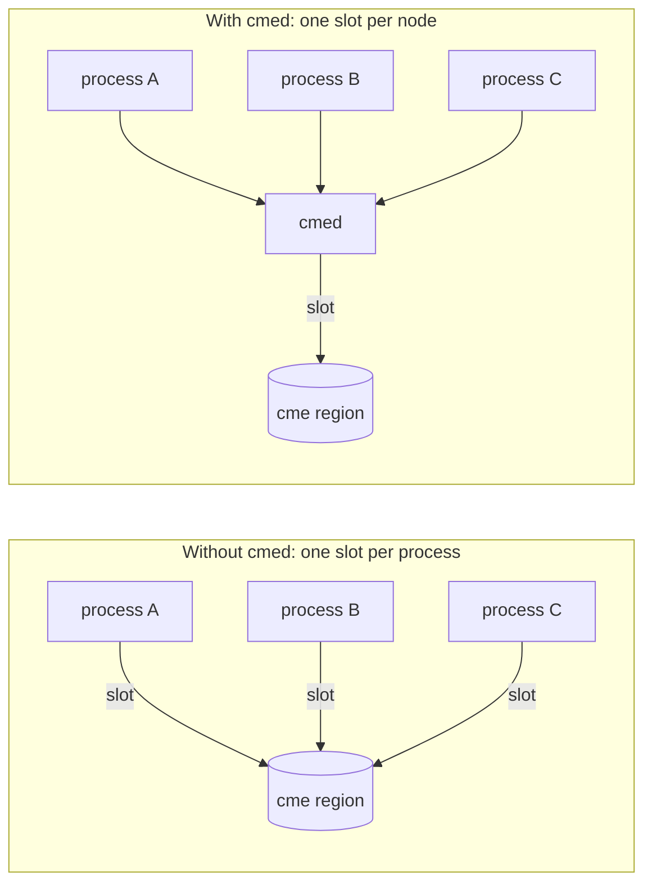
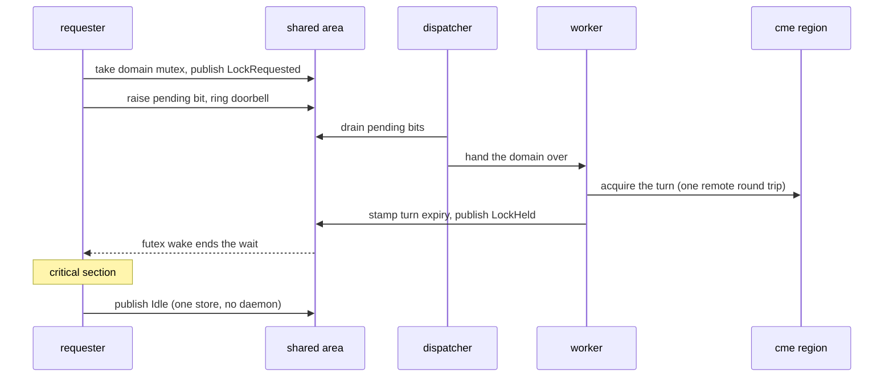
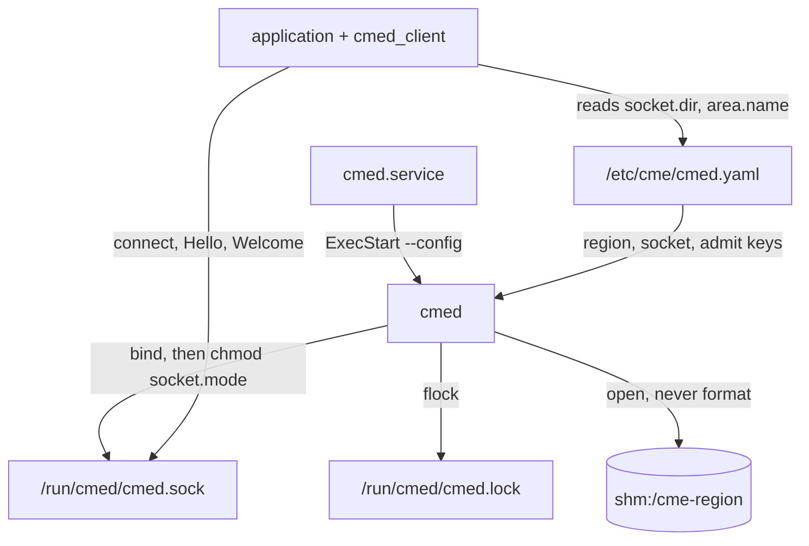

<!--
SPDX-License-Identifier: Apache-2.0
Copyright XCENA Inc.
-->

# cmed

One cme peer slot per node, serving every requester on that node.

## Why a daemon

A cme region gives out ownership of a domain to a peer, and a peer is a process.
A turn is the region's agreement about which peer may use a domain now.
Taking a turn is one remote round trip across CXL.

A region is laid out with 64 peer slots, and they are slots for the whole fabric, not per node.
Without a daemon, every local process that opened the region would hold one.
Eight nodes running eight such processes each would fill the whole table, and the ninth process anywhere would find no slot.
Those processes would also contend across CXL for turns they could have settled locally, one round trip per acquire.

cmed takes one slot and serves the local processes behind it.
The same eight nodes then hold eight slots, and a domain crosses the interconnect once per cohort rather than once per requester.
A cohort is the run of local acquires served on one held turn.

The diagram contrasts the two shapes on one node.



## What it does

Two artifacts come out of this directory.

`cmed` is the daemon, and it owns everything that touches the region.
It opens the region as this node's one peer, lays out a shared area, binds a socket, and takes and returns domain turns as local demand asks.

`cmed_client` is the library a requester links.
A requester connects to the socket, receives the area, and from then on acquires and releases through that area.
It needs neither libcme nor the region's uri, and it cannot reach the region except through a turn the daemon took.

What cmed refuses is part of the same contract.
It never formats the region, because a format zeroes what the peers on other nodes are using.
It refuses a config file that group or other can write, a world-writable socket mode, a worker count of zero, a turn hold that outlives its grants, and a coherency name it does not know.
It refuses a connect from an account its admit policy does not name, a greeting from a build with a different ABI, and any command from a connection that has not greeted.
It exits rather than serve beside another daemon of the same name.

## The socket and the area

Setup and control travel over a `SOCK_SEQPACKET` socket bound at `<socket.dir>/<area.name>.sock`.
A requester opens with a Hello, and the daemon's Welcome carries the shared area as an attached descriptor.
The area itself is an anonymous in-memory file with no name in any filesystem, so only a requester the socket admitted can ever reach it.
The domain commands, create, delete, join and leave, travel the same way and are answered with a zero-or-errno result.
The connection then stays open for one purpose.
The daemon's epoll sees it drop and gives back whatever that requester had joined, so a requester that dies does not pin its domains.

Locking never touches the socket.
The area carries one record per domain: a robust mutex, the request's state words, and a doorbell word beside them.
The diagram shows one acquire while the node does not hold the domain's turn.



The daemon stamps an expiry beside the turn when it takes one.
An acquire that finds the stamp still ahead takes the grant itself, and that path is loads and stores in a local mapping, with no syscall on the granted side.
A release is one store either way.
The holder publishes Idle and asks the daemon nothing, and the turn stays with the node for the next local acquire until its hold runs out.

## From nothing to a held lock

Build, lay out a region, start a daemon, and lock.

```
cmake -S . -B build
cmake --build build -j
build/tools/cme-format --uri shm:/cme-region
```

The region has to exist before the daemon starts, and cmed never formats one.
Without it the daemon exits `1`, and the stderr line names the region's `shm_open(attach)` failure.
The tool refuses a region that already answers unless `--force` is passed, so running it twice is safe.

The daemon's defaults put the socket under `/run/cmed`, which is root's to create, so a development run names its own directory:

```
mkdir -p /tmp/cmed
chmod 0600 daemon/tests/cmed-dev.yaml
build/daemon/cmed --config daemon/tests/cmed-dev.yaml
```

That file names `/tmp/cmed` and a shm region, which is the whole of what a run out of the build tree differs by.
The `chmod` matters, because the reader refuses a config file group or other can write, and a checkout under a 0002 umask leaves it 0664.
Naming `area.name` matters, because a requester's config loader takes the socket path from that key and `socket.dir`, and fills in neither.
In a second terminal, a requester is a handful of calls.

```cpp
#include "cmed/session.hpp"

// The daemon's file supplies socket.dir and area.name, which name the socket.
// This application's own file carries only its deadlines, and may be absent.
auto config = cmed::loadClientConfig("client.yaml", "cmed.yaml");
auto session = cmed::CmedSession::connect(config);

session.createDomain("orders");
{
    cmed::CmedGuard held = session.lock("orders");
    // the critical section, excluded against every process on every node
}
session.leaveDomain("orders");
```

Link `cmed_client` and nothing else.
`cmed::CmedSession::connect("/tmp/cmed/cmed.sock")` is the overload for a caller that knows the socket path some other way.
`tryLock(name, timeout)` is the bounded acquire, and the guard's destructor releases on every exit path.

```
ctest --test-dir build -R '^cmed_'
```

## Configure

Two files, and each side writes only its own.
Whoever decides a value owns the file it lives in.

The daemon's file is `deploy/cmed.example.yaml`, deployed to `/etc/cme/cmed.yaml` unless `--config <path>` says otherwise.
It carries what the daemon decides: the run's name (`area.name`), the socket's place and mode (`socket.dir`, `socket.mode`), who may connect (`admit.uids`, `admit.gids`), the region (`region.uri`, `region.coherency`), how long a turn is held and how long a grant stays valid (`cohort.hold_ms`, `cohort.grant_validity_ms`), the worker pool (`workers.count`), and the pace of its passes.
The example file documents every key beside its default.

An application's file is `deploy/cmed-client.example.yaml`, and where it lives is that application's choice.
It carries what the application decides: how long to wait for the Welcome once connected (`client.setup_timeout_ms`), and how long to wait for a grant (`client.lock_timeout_ms`).
Two programs on one node can want a 50 ms acquire and a 30 s one, which is why these are not node-wide.

**The socket path is the daemon's, and a requester builds it out of the daemon's file.**
`loadClientConfig` takes two paths, the application's file and the daemon's, and joins the daemon's `socket.dir` and `area.name` into the socket path.
An application cannot name its own path, because the daemon bound the socket where its own file says, and a second copy of that decision could only disagree with it.

Every key in the daemon's file is optional and falls back to the value the example shows, so a daemon runs with no file at all.
The application's own keys default the same way.
The two keys a requester takes from the daemon's file do not default.
`loadClientConfig` has no fallback for the socket path, so that file has to exist and name `socket.dir` and `area.name`.

## Deploy

`deploy/cmed.example.service` is a systemd unit to copy and edit, and nothing in `deploy/` is installed by a build.

```
install -m 0755 build/daemon/cmed /usr/local/bin/cmed
useradd -r -s /usr/sbin/nologin cme
install -d -m 0755 -o root -g root /etc/cme
install -m 0644 daemon/deploy/cmed.example.yaml /etc/cme/cmed.yaml
install -m 0644 daemon/deploy/cmed.example.service /etc/systemd/system/cmed.service
systemctl daemon-reload && systemctl start cmed
```

Give the unit a `RuntimeDirectory=cmed` line, so `/run/cmed` exists fresh each start and belongs to the service before the bind.
The daemon creates no directories, and the unit's `ProtectSystem=strict` keeps it from writing anywhere it was not given.
The region backend decides one more unit line: `dax:` needs a `DeviceAllow`, `file:` needs a `ReadWritePaths`, and `shm:` needs neither.
The unit file carries all three, commented, beside the keys they pair with.

The diagram shows what reads what at start, and where a requester meets the result.



The unit is `Type=notify`, so `systemctl start cmed` does not return until the daemon has opened the region, laid out the area, bound the socket, and started its serving threads.
A daemon that cannot do those things fails at that command instead of being reported as started.

The unit also arms a watchdog.
The daemon sends the keep-alive from its maintenance thread, and only when the dispatcher has taken a pass since the last one.
A dispatcher that stops taking passes therefore stops the keep-alives while the process is still up, and the manager restarts the daemon.

Three exit codes matter.

`0` is a clean stop.
A signal ends the daemon's loops rather than the process, which is what releases the cme peer slot and removes the socket.

`1` is a failure to start, with the reason on stderr.

`3` is another daemon already serving this name.
The flock on `<socket.dir>/<area.name>.lock` decides it, so two daemons launched at one instant cannot both win.
That is a deployment mistake and not a fault, so the unit carries `RestartPreventExitStatus=3` and a supervisor does not retry it.

What a wrong setting costs, for the mistakes worth knowing in advance:

| Setting | Wrong value | What happens |
|---|---|---|
| config file mode | group or other writable | refused, exit `1` |
| `socket.dir` | directory does not exist | bind fails, exit `1` |
| `socket.mode` | world-writable | refused, exit `1` |
| `region.uri` | names nothing | `shm_open(attach)` on stderr, exit `1` |
| `region.coherency` | not a known mode | refused, exit `1` |
| `workers.count` | `0` | refused, exit `1` |
| `cohort.hold_ms` | at or above `grant_validity_ms` | refused, exit `1` |
| `area.name` | same name started twice | second daemon exits `3` |
| `admit` | requester's account not listed | its connect is refused |

The last row is silent on the daemon's side by design, and the requester sees its connect fail.

## Permissions

The operator decides who reaches cmed, through the config file's mode and the socket's admission.
The daemon refuses rather than adapts.
A file it cannot trust is a file whose contents it will not act on.

### The config file

**Both readers refuse a config file that group or other can write.**
The daemon's file names the region the daemon opens, and a requester reads that same file to learn which socket to trust.
Whoever can rewrite it can point either process at an object of their choosing, and nothing downstream would look wrong.

Deploy it with an explicit mode rather than by copying:

```
install -d -m 0755 -o root -g root /etc/cme
install -m 0644 daemon/deploy/cmed.example.yaml /etc/cme/cmed.yaml
```

`install -m` sets the mode itself, so the unit's `UMask=0077` does not narrow it and a permissive umask does not widen it.
Plain `cp` would take the umask instead, because a copy creates the destination and a create is masked.

**A file straight out of a checkout will usually be refused.**
git writes working files with whatever the developer's umask allows, and it tracks only the executable bit, so the mode is the checkout's and not the repository's.
Under `umask 002` every file in the tree is `0664`, which group can write.
`chmod 0644` fixes one checkout and nothing else, because the next clone is `0664` again.

So do not point `--config` at `deploy/cmed.example.yaml` in a source tree.
Copy it to a file you create yourself, or install it as above.

### The socket

Admission happens at connect, and it has two gates.

The first gate is the socket file's mode, the `socket.mode` key.
It is applied with `chmod` after the bind, because a create is masked by the umask and a deployment asking for group access would otherwise silently not get it.
World-writable is refused at config load.

The second gate is the admit policy, judged against the credentials the kernel stamps on the connecting process.
An empty policy admits the daemon's own uid alone.
`admit.uids` and `admit.gids` widen it, and an entry is an account name or a numeric id.
A gid entry matches the connecting process's primary group only, because that is all the kernel stamps at connect.

Past admission there is no third check.
A requester that received the area can write any word in it, including the state a grant is published in.
So the admit policy is the whole trust boundary, and an account on it is trusted with every domain the daemon serves.

## Develop

**Write your own configs rather than pointing at the examples.**
`daemon/daemon.yaml` and `daemon/client.yaml` are the conventional spots.
They are per-machine files, you create them, and their mode is `0600` because you created them.

```
cp daemon/deploy/cmed.example.yaml daemon/daemon.yaml
cp daemon/deploy/cmed-client.example.yaml daemon/client.yaml
chmod 0600 daemon/daemon.yaml daemon/client.yaml
```

The `chmod` is the point of the copy.
`cp` takes the umask, and under `umask 002` the result is `0664`, which the reader refuses.

The `config.yaml` at the repository root is a different file with a different reader.
It carries per-machine facts for the test harness, such as which devdax node this host has, and CMake reads it at configure time.

**Foreground runs need no service manager.**
`READY=1` goes nowhere outside one, because `NOTIFY_SOCKET` is unset and the notify call then does nothing.
`SIGINT` or `SIGTERM` ends the loops, which releases the peer slot and removes the socket on the way out.

A second daemon on the same name exits `3` and leaves the first one alone.
A daemon that was killed rather than signalled leaves the socket file and the lock file behind.
Neither blocks the next start.
The kernel released the flock at the death, and the bind removes the leftover socket path before taking it.
The orphaned area needs no cleanup either.
Mappings already taken stay valid until their owners unmap, and the object is gone when the last one does.

**The shm backend leaves one object visible.**

```
ls /dev/shm            # cme-region is the region
```

The area appears nowhere in the filesystem, because it is an anonymous file.
The socket and the lock sit under `socket.dir`.

**Tests.**

```
ctest --test-dir build -R '^cmed_'
```

Most probes build the daemon's pieces inside their own process.
The exceptions exec the built binary: `cmed_startup_probe` is the case that fails when `main()` refuses a config it should accept, `cmed_multinode_probe` stands daemons on one region as separate peers, and `cmed_crash_probe` kills a daemon outright and checks the region afterwards.
Those three are the only ones that open a region through a daemon, so each is registered once per medium: the base name runs on POSIX shm, `_dax` on a devdax window, and `_file` on an uncacheable mount.
A medium this machine does not have reports skipped rather than failed.

## Layout

`shared/` is what both halves compile: the wire contract under `shared/protocol/`, the POSIX wrappers under `shared/posix/`, the futex and robust-mutex primitives under `shared/util/`, and the mapped area itself.
`shared/include/cmed/` carries the error hierarchy both sides throw.

`client/` is the requester's half, and `client/include/cmed/` is the surface an application includes.
`daemon/` is the daemon's: `startup/` comes up, `control/` answers the socket, `serve/` turns the dispatcher, the workers and the maintenance pass, `domain/` owns the name table and the turns, and `observe/` names what a run counts.

A requester links `cmed_client` and never `cmed_daemon`, so the calls that would zero the area or consume another requester's pending bit are absent at link time rather than merely undocumented.

`deploy/` holds the two example config files and the example unit.
`tests/` holds one probe binary per subject, so a case that wedges takes only its own probe down.
