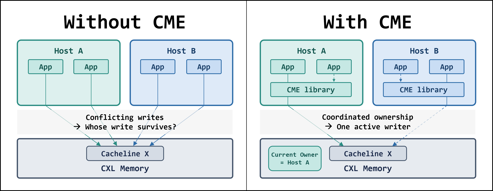
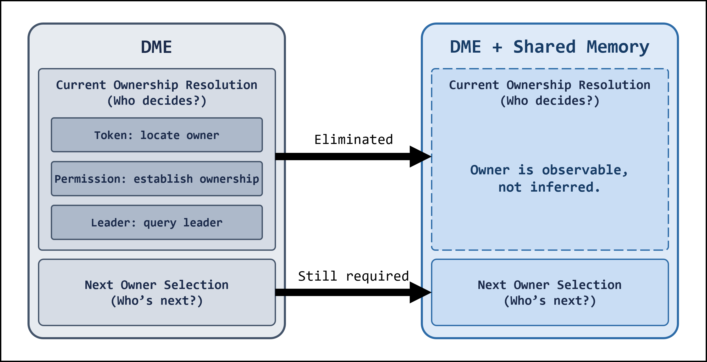
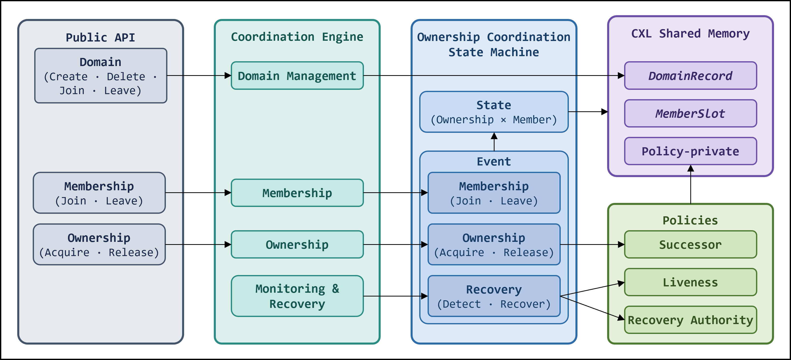
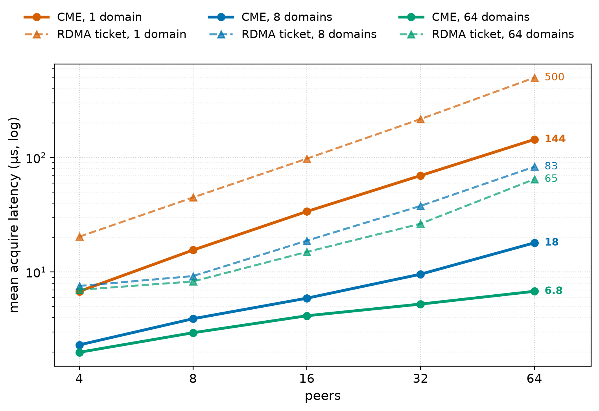

# CXL Gave Us Shared Memory. It Did Not Give Us a Mutex.

## Mutual exclusion on atomic-free, non-coherent shared memory

CXL fabric-attached memory lets multiple hosts access the same physical memory.

Host A can write a cacheline.
Host B can write the same cacheline.

Both stores work.
But whose write survives?

A mutex can coordinate applications on one host.
It cannot stop an application on another host from writing the same CXL memory at the same time.

And in the environment we target, the usual hardware tools are missing:

* No cross-host atomic read-modify-write — no compare-and-swap, no fetch-and-add
* No cross-host cache coherence

Shared memory is there.
The mutex is not.

*Local mutexes can serialize applications within each host.
CME coordinates ownership across hosts so that only the current owner writes to shared CXL memory.*

***

## No Atomics: Where the Old Road Ends

Most locks eventually depend on one thing: an atomic lock word.
Spinlocks, ticket locks, MCS locks, futexes, RDMA locks built on NIC atomics — all assume that hardware can select one winner.

CXL shared memory cannot do that across hosts.
Picking a winner takes something that can serialize the attempts.
Between hosts, nothing does.

So the old road ends here.
Whatever comes next has to be built, not borrowed.

***

## Shared Memory: Where a New Path Appears

Classical distributed mutual exclusion (DME) starts from an assumption that does not hold with CXL:

> The participants do not share memory.

With nothing to read, ownership has to be discovered or established by exchanging messages.
Token, permission, leader — the mechanism differs and the problem underneath does not.

Nobody can see the current owner directly.

CXL shared memory changes that assumption.
There is a place to put the ownership state.
Every peer can read it directly.

No token search.
No permission broadcast.
No lock server.

The owner is observable, not inferred.

Of the classical problem, all that remains is choosing who goes next.

*Shared memory eliminates current ownership resolution.*

***

## Shared Memory: The Gift Came With Obligations

Shared memory gave us a place to put the ownership state.
It did not give us anyone to keep that state correct.

Once multiple hosts depend on it, someone has to manage it.

On a single host, that responsibility has a natural home: the kernel.
Multi-host shared memory is different.

Someone has to answer these questions:

* Who may write next?
* Who takes over after a crash?
* Who tracks peers and resources as they come and go?
* Who keeps coordination running when no one is asking?

CME started as mutual exclusion.
The name still says so.

A mutex answers only the first question.
A real multi-host deployment has to answer all four.

At that point, we were no longer building a mutex, but **ownership coordination**.

***

## CME: An Ownership Coordination Framework

CME ships as a library inside every peer.
There is no central coordinator.

All of the coordination state lives in CXL memory itself: who owns what, who is a member, and whatever extra a policy needs.

CME has three parts.

**The core** is a state machine over membership, ownership and recovery.
If the core is wrong, two peers write at once.

**The policies** answer the questions that change with the deployment.
Who goes next. Who counts as dead. Who recovers that peer.
The core stays the same, and the answers can change.

**The engine** runs in the background inside every peer.
It handles ownership, membership, liveness and recovery.
Whenever there is a choice, it asks the policies.

Back to the four questions:

* *Who may write next?* The ownership state machine, with the successor policy.
* *Who takes over after a crash?* The liveness and recovery-authority policies.
* *Who tracks peers and resources as they come and go?* The membership state machine.
* *Who keeps coordination running when no one is asking?* The engine.

*What replaces the mutex: an engine that keeps running; a state machine over membership, ownership and recovery; coordination state in CXL memory that outlives any call; and the decisions left open as policy.*

***

## Performance Under Contention

The worst case we measured was 64 peers on one hot domain.
CME acquired ownership in about **144 μs**.
With the same 64 peers spread over 64 domains, acquire took about **7 μs**.
Most of the 144 μs was waiting for a busy domain, not coordination work.

[RDMA locks](https://www.cs.sfu.ca/~tzwang/farlock.pdf) solve the same problem on a different substrate, using NIC atomics.
That makes them a useful reference point for CME.
On the same workload, a ticket lock reached **500 μs** in that worst case.

One caveat on scope: the CME numbers come from one host, with peers as processes coordinating through the CXL device.
The current results exclude cross-host timing.
We expect higher latency but similar trends, and will update the results once our CXL switch environment is ready.

*Acquire latency as peers rise.
Each colour is one domain count, so the solid and dashed lines of a colour are the pair to compare.
The dashed lines are a ticket lock over RoCE, on different hardware.*

***

## Wrapping Up

CXL gave us shared memory.
It did not give us cross-host atomics.

So the old problem did not get harder or easier.
It got different.

Nobody has to search for the owner anymore.
The owner is written down.

What remains is deciding who goes next, who takes over when an owner crashes, and who keeps ownership moving as peers come and go.

That is CME.

The technical report has the rest: memory model, formal specification, recovery, implementation, policies, and full evaluation.

***

### Suggested tags

`CXL` · `Shared Memory` · `Distributed Systems` · `Concurrency` · `Systems Programming`
