# CME: Ownership Coordination on Non-Coherent Shared Memory

**A Design Philosophy and Architecture Reference**

> Status: DRAFT v0.1 (2026-07-03). This is the canonical internal reference for the CME
> project. It records design principles and the decisions behind them — not implementation
> details, which live in `docs/` and the code. Medium-facing articles are derived from this
> document, not the other way around.

---

## Table of Contents

1. [Introduction](#1-introduction)
2. [Design Evolution: From Distributed Mutual Exclusion to an Ownership Coordination Framework](#2-design-evolution-from-distributed-mutual-exclusion-to-an-ownership-coordination-framework)
3. [System Model and Core Requirements](#3-system-model-and-core-requirements)
4. [State Machine](#4-state-machine)
5. [Architecture](#5-architecture)
6. [Coordination Policies](#6-coordination-policies)
7. [Recovery](#7-recovery)
8. [Formal Modeling (TLA+)](#8-formal-modeling-tla)
9. [Implementation Notes](#9-implementation-notes)
10. [Coordination Policies: Design and Implementation](#10-coordination-policies-design-and-implementation)
11. [Evaluation](#11-evaluation)
12. [Related Work](#12-related-work)
13. [Lessons Learned](#13-lessons-learned)
14. [Conclusion](#14-conclusion)
- [References](#references)
- [Appendix A — Fencing over non-coherent memory](#appendix-a--fencing-over-non-coherent-memory)
- [Appendix B — Case study: multi-writer famfs](#appendix-b--case-study-multi-writer-famfs)

---

## 1. Introduction

### 1.1 Problem Setting: Shared Memory Without Coherence or Atomics

CXL fabric-attached memory (FAM) gives multiple hosts byte-addressable access to the same physical memory.
What it does *not* give — in the deployments we target ([§3.2](#32-system-model)) — is cross-host cache coherence or cross-host atomic operations such as CAS.
Every classical shared-memory synchronization primitive assumes at least one of those two facilities.
On non-coherent shared memory, both are gone.
This combination — shared memory without coherence or atomics — is the **«target environment»** of this report.

Yet sharing is precisely what creates the need for coordination.
A shared filesystem, a shared KV cache, a shared metadata region — every one of them needs an answer to the question *"who may write this, right now?"* CME is where answering it led us: a coordination framework that provides named, recoverable, exclusive ownership of *domains* (logical resources) over a raw shared-memory region, using only plain loads and stores.

### 1.2 Why Existing Approaches Don't Fit: Every Answer Assumes a Different Environment

The «target environment» ([§1.1](#11-problem-setting-shared-memory-without-coherence-or-atomics)) is one combination of three facilities: **shared memory**, **coherence**, and **atomics**.
Every existing answer assumes a different combination:

| Assumed environment | Shared memory | Coherence | Atomics | Answers built there |
|---|---|---|---|---|
| Message-passing distribution | ✗ | — | — | DLM, DSM, DME |
| RDMA fabrics | ✗ (remote ops, µs RTT) | ✗ | ✓ (NIC-executed) | RDMA-based DLM & DSM |
| Coherent shared memory | ✓ | ✓ | ✓ | the mutex family |
| **Non-coherent shared memory** | **✓ (ns load/store)** | **✗** | **✗** | **this report** |

The message-passing camp solves a discovery problem — and in the «target environment» that problem disappears ([§12.5](#125-message-passing-distributed-mutual-exclusion)).
The mutex camp stands on coherence and atomics — and the «target environment» has neither.
The RDMA camp is the exact opposite of ours: expensive access with an arbitration primitive, versus our cheap access without one.
Each family does not fit the «target environment», each for a different reason:

- **Distributed Lock Managers (DLM)** — cluster DLMs like GFS2/OCFS2's, lock services like Chubby [[4]](#references) and etcd — assume **no shared memory**.
  Under that assumption, lock state can only be reached by messages, and the authoritative copy must live somewhere: on a designated lock server, or across a quorum of replicas.
  The modern high-performance variants keep the assumption and only change the transport: the lock word sits in remote memory and clients update it with RDMA atomics.
  In the «target environment» the assumption itself is false: every peer can read the lock state directly, so messages, servers, and quorums are no longer needed ([§12.3](#123-distributed-lock-managers)).
- **Distributed Shared Memory (DSM)** starts from the same no-shared-memory assumption but goes in the opposite direction from DLMs: instead of working around the missing shared memory, it fakes one — a software layer that imitates coherent shared memory on top of messages [[5]](#references)[[6]](#references).
  Today the same layer is rebuilt on top of RDMA, with RDMA atomics arbitrating its coherence metadata.
  The material got faster; the approach is still emulation.
  We already have real shared memory.
  What we lack is arbitration, and emulating coherence does not provide it.
- **Distributed Mutual Exclusion (DME)** algorithms — Ricart–Agrawala [[7]](#references) and the token lineage [[8]](#references), up to today's variants — assume the same no-shared-memory row.
  Most of their complexity goes into one question: *"where does ownership live right now?"* On shared memory, one load answers that question, and most of the algorithm disappears with it ([§2.1](#21-initial-approach-distributed-mutual-exclusion-with-shared-memory), [§12.5](#125-message-passing-distributed-mutual-exclusion)).
- **Shared-memory mutexes** (futex, MCS [[17]](#references), spinlocks) stand on hardware atomics; without atomic RMW, that toolbox does not exist here.
  (The load/store-only subfamily — Peterson [[10]](#references), the bakery algorithm [[9]](#references) — is a different case: it shares our assumptions and survives the move to the «target environment».
  It is not a misfit but a building block — a Peterson descendant is one of CME's policies; [§11.3](#113-policies-compared), [§12.6](#126-loadstore-only-mutual-exclusion).)

Each family gets only one paragraph here on purpose; [§12](#12-related-work) covers them properly.

### 1.3 What this document is

This is a *design record*, not a manual.
Papers compress the path into the destination; this document deliberately preserves the path — rejected designs, the reasoning that killed them, and the reinterpretations that reshaped the architecture — because the path is what a future filesystem paper and future maintainers will actually need.
The three load-bearing chapters are [§2](#2-design-evolution-from-distributed-mutual-exclusion-to-an-ownership-coordination-framework) (how the problem definition itself evolved), [§4](#4-state-machine) (the ownership state machine, the system's core model), and [§13](#13-lessons-learned) (what we learned).

---

## 2. Design Evolution: From Distributed Mutual Exclusion to an Ownership Coordination Framework

*The single most important chapter.
The system was not designed once; it was reframed twice — by deployment demands the first time, by formal modeling the second.*

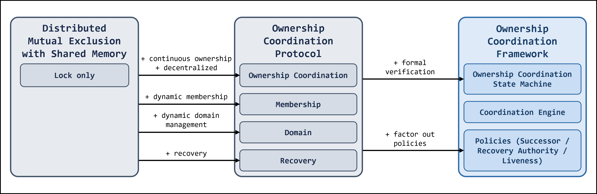

> **Figure 2-1.** Design evolution: Distributed Mutual Exclusion with Shared Memory → Ownership
> Coordination Protocol (adding continuous ownership, dynamic membership, dynamic domain
> management, recovery) → Ownership Coordination Framework (state machine + coordination
> engine + pluggable policies).

### 2.1 Initial Approach: Distributed Mutual Exclusion with Shared Memory

The initial framing was a question: can software-only mutual exclusion deliver practical performance in the «target environment»?
Single-node mutual exclusion splits in two, and both halves fell at the door.
Hardware locks (ticket, MCS) need the atomics and coherence the «target environment» lacks.
The software lock, Peterson, was reported impractical on CXL — a flush-forced port ran ~3000× slower than an RMW baseline [[18]](#references) — and was therefore not adopted as the initial design point.
What remained was classical DME: peers contend for a lock; the lock has a holder; algorithms decide who gets it next.

But DME could not be used as-is either: its algorithms assume no shared memory, and giving them one changes what they are.
The classical DME families spend their entire complexity budget — broadcast, tree direction hints, quorum intersections, consensus leadership — on one question: *"who decides ownership right now?"* In the «target environment», one load of the authoritative record answers it.
Discovery was gone; the one design decision left was *"who's next?"* So the initial mechanisms were built around exactly that question — request-driven and order-driven successor selection, the two shapes the message-passing families collapse into ([§12.5](#125-message-passing-distributed-mutual-exclusion) records the family-by-family collapse).

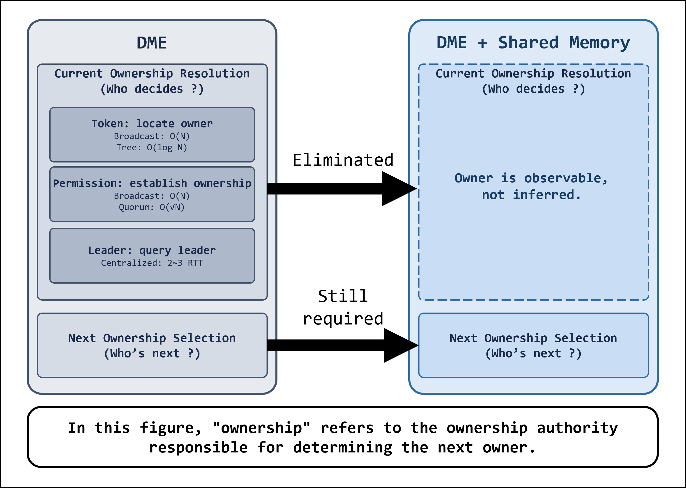

> **Figure 2-2.** *Discovery collapses; who's next remains.* Traditional DME answers *who decides
> ownership right now?* by discovery — token schemes locate the owner (O(N) broadcast, O(log N)
> tree), permission schemes establish it from grants (O(N) broadcast, O(√N) quorum), leader
> schemes query the leader (centralized, 2–3 RTT). Shared memory makes the owner observable
> rather than inferred, so a single load answers it and the question is eliminated; only *who's
> next?* still requires a decision.

The first design question came from the combination itself: what to represent in shared memory.
Without messages, everything a peer needs to know — who holds a domain, who wants it, who is alive — has to exist as readable state.
The initial design answered with a per-domain record, doorbell slots, and membership slots.
The layout worked, and it survives to this day.

From there, two families of questions took over the design.

The first is about the record itself: *"who may write it?"* The «target environment» is non-coherent and has no atomics, so a record is safe only with a single writer at any instant ([§9.1](#91-one-writer-per-cacheline)).
That write right can never lapse — someone must hold it at every moment, through release, crash, and slot reuse.
Managing that right, continuously, is the problem of **ownership**.

The second family came from deployment.
The system was being built for a shared filesystem over this memory, and that fixed two conditions from the start: no central server or leader, and continuous operation while peers come, go, and crash.
Under those conditions the system had to cover far more than lock hand-offs:

- **Recovery.** Peers die holding domains.
  Heartbeats, crash detection, and successor determination become necessary — but the lock model does not cover recovery, so nothing in the model can vouch for them.
  Underneath, this is an agreement problem: survivors must agree that a peer is dead, and agree on who takes over.
- **Dynamic membership.** Peers join and leave at any time.
  Who participates is itself a shared fact the peers must agree on, through churn.
- **Dynamic domain management.** Data domains are created and deleted at run time.
  Which domains exist is another shared fact requiring agreement.

Each of these is an agreement that peers must reach among themselves, with no server to reach it for them: who is dead, who takes over, who participates, which domains exist.
Running through all of them is one requirement — peers cooperating, all the time: **coordination**.
Mutual exclusion covered a small fraction of what deployment demanded; the DME abstraction was no longer sufficient.

### 2.2 First Reframing: Ownership Coordination Protocol

[§2.1](#21-initial-approach-distributed-mutual-exclusion-with-shared-memory) left two families of questions: **ownership** — a write right that may never lapse — and **coordination** — agreements that peers must keep reaching, with no server to help.
Together they change the abstraction fundamentally: the protocol worth specifying answers both at once, and its name says so — an ownership coordination protocol.

- **The ownership half changes what the system protects.** DME protects a critical section — the question is *"who enters next?"*, and after release the model's job is done.
  CME protects ownership — the question is *"who owns this, at every moment?"*, and the job never ends.
- **The coordination half changes what a participant is.** A lock is passive: it provides `lock()` and `unlock()`, and between calls it does nothing and knows nothing.
  Standing agreements need standing work.
  So in CME a peer first joins a session, and locks within it.
  Joining means taking on duties run by a background thread whether or not the application ever acquires anything: publish a heartbeat, watch the liveness of others, take part in recovery when a peer dies.
  The lock call stays, but callers become members.

The reframing, laid out side by side — the lock model is *partial* (it defines acquire and release, and nothing else), the ownership-coordination model is *total* (every event, crash included, has a defined transition from every state):

| | Lock model | Ownership coordination model |
|---|---|---|
| Participant | A caller — exists during `lock()`/`unlock()` | A member — joins a session and carries standing duties (heartbeat, liveness, recovery) |
| Object managed | The lock: acquire or release | The ownership: at most one owner at every instant, arbitrated without a break |
| Acquire | Take the lock — by contention, queue, or token | Be handed ownership by the current owner (or by recovery) |
| Release | Clear the lock | Choose a successor and publish the transfer |
| The holder dies | Assumed not to happen | The dead peer still owns the domain until recovery *transfers* it away — the same primitive, different initiator |
| Fairness under churn | A property of a wait queue whose members are assumed immortal | A property of the successor policy over *live* membership, decided at each transfer |
| Who owns an idle domain | "Free" = nobody responsible; two observers can decide to claim at once ([§4.7](#47-invariants)) | Possibly nobody — but vacancy is a decision, never dereliction: an idle domain still has a designated next writer, not whoever observes it first |
| Time with no acquisitions | Nothing to maintain — the model is silent | The arbitration exists continuously; watching it is ordinary state maintenance |

This frame carried the rest of the design, and formalizing it produced the second reframing.

### 2.3 Second Reframing: Ownership Coordination Framework

Formal modeling forced the second reframing ([§8](#8-formal-modeling-tla)): a specification written per successor method duplicated everything except one choice point — *"who next?"* — that any method could fill.
The same held for the other axes of variation, recovery authority and liveness.
The point of the abstraction is not to settle which method is better; different systems favor different methods, and the framework should not care.
Each policy answers its one question, and the core runs the same way whichever policy produced the answer.
The system factored accordingly:

- a **core** — the ownership coordination state machine ([§4](#4-state-machine), spanning domain ownership, peer state, and recovery) together with the coordination engine that drives it — the parts with correctness burden; and
- pluggable **policies** — successor choice, recovery authority, liveness — each answering one narrow question — the parts that vary per deployment.

The factoring was trustworthy from the start: each policy's answer enters the model as a nondeterministic oracle ([§8.4](#84-abstractions-and-limits)), so the core is verified to work independently of the policies.
([§6.1](#61-why-a-policy-abstraction) covers the abstraction as implemented.)

The abstraction soon proved itself in practice.
Early evaluation implemented the successor policies abstracted from DME — order-driven and request-driven — and brought back Peterson's tournament as the comparison point — the algorithm passed over in [§2.1](#21-initial-approach-distributed-mutual-exclusion-with-shared-memory) on its reported overhead.
Direct measurement said the opposite: at low contention Peterson was decisively fastest.
The comparison exposed a mismatch in the evaluation criterion: Peterson arbitrates alone, whereas CME simultaneously provides ownership management, recovery, and coordination — a bare arbitration algorithm and a framework are not commensurable.
The resolution is structural: CME is not a lock competing with Peterson but a framework, and Peterson runs inside it — integrated as one more successor policy ([§6.1](#61-why-a-policy-abstraction)).
**Arbitration is not the defining characteristic of the system but a replaceable part**, and the evaluation question changed accordingly: not *"is it faster than Peterson?"* but *"can one framework support multiple arbitration policies while simultaneously providing ownership management, recovery, and scalable coordination?"* ([§11](#11-evaluation) inherits this methodology.)

---

## 3. System Model and Core Requirements

*The fixed premises.
Later chapters argue from this environment and these requirements, not about them.*

In three parts: the vocabulary the rest of the report is stated in ([§3.1](#31-terminology)); the «target environment» — what the hardware provides and what it withholds ([§3.2](#32-system-model)); and the requirements any ownership coordination mechanism over that environment must satisfy ([§3.3](#33-core-requirements)) — the criteria the designs of [§4](#4-state-machine)–[§7](#7-recovery) answer to.

### 3.1 Terminology

| Term | Definition |
|---|---|
| **Domain** | A named logical resource over the shared region (a filesystem region, a cache shard), created and deleted at run time. The unit of coordination. |
| **Peer** | A participant in the coordination: an entity that reads and writes the shared region and fails independently of other peers. Concretely, in this system, a process on a host sharing the FAM region. |
| **Ownership** | The exclusive authority to modify a domain. |
| **Coordination** | The standing agreements peers must keep reaching among themselves, with no server to help: who is alive, who participates, which domains exist. |

### 3.2 System Model

The «target environment» is motivated by CXL fabric-attached memory (FAM) deployments.
Three hardware landscapes point the same way for coordination state:

- **CXL 2.0 (the target)** — shared memory across multiple hosts without cross-host cache coherence; software coordination is the only option.
- **CXL 3.0 (hardware coherence)** — Back-Invalidate (BI) coherence needs a per-line (or coarser) directory/snoop-filter on the sharing device and two extra protocol channels (BISnp/BIRsp) with a link-efficiency cost, and the survey literature itself qualifies it to read-mostly sharing: hardware coherence "can scale for these applications where it is mostly read-only," with software coherence "desirable" in other cases [[1]](#references).
  Coordination state is the opposite — every protocol line is a write-hot communication line.
- **RDMA (hardware atomics)** — the NIC serializes remote atomics behind internal per-address locks; they collapse under contention, and an RPC-based software design measured 50× better [[2]](#references).

Where the facility is absent, software coordination is forced; where hardware provides it, it is not the fast path for coordination state.
Accordingly, this report targets the general case: non-coherent shared memory.

The system model:

- **Shared byte-addressable memory**, accessed with plain aligned loads and stores.
- **No hardware cache coherence across hosts.** Writers make stores visible by explicit flush (`clflushopt`+`sfence`) or by uncached mappings; readers may observe stale values, and reads spanning cachelines may be torn.
- **No cross-host atomic read-modify-write primitives** (e.g., CAS).
- **No distinguished coordinator.** No server, no leader, no quorum service — not because the hardware forbids one, but because building one needs the cross-host agreement this environment withholds, while shared memory supplies its role directly ([§2.1](#21-initial-approach-distributed-mutual-exclusion-with-shared-memory)).
  The shared memory itself is the only facility peers have in common.
- **Crash-stop failures.** Peers fail by stopping (crash, SIGKILL, host loss) — silently, at any protocol point, with no failure notification.
  Failure is inferred from heartbeat silence, which is inherently a timeout judgment: a slow peer and a dead peer are indistinguishable within the window.
  Fencing a "dead" peer that is actually alive requires platform enforcement (FAM revoke), deliberately scoped out of the library ([§7.2](#72-the-fencing-boundary)).
- **Dynamic membership.** Peers join and leave at run time and observe each other only through FAM reads that may lag reality.
  Membership is therefore always a *belief*, never a fact; every consumer of membership must tolerate staleness bounded by its own re-check.

### 3.3 Core Requirements

An ownership coordination mechanism over this system model shall satisfy:

- ***R1 — Exclusive ownership.*** At every instant, at most one peer shall hold the authority to modify each domain (mutual exclusion) — and ownership shall be obtainable only from the domain's current arbitration authority: an apparently ownerless domain is never claimable state.
- ***R2 — Ownership continuity.*** The chain of arbitration shall never break: ownership shall move, end, or persist only by decision of the domain's current arbitration authority, never by accident.
  A crashed owner remains the owner until recovery decides on its behalf; a leaver hands off unconditionally, having no recovery to fall back on; a domain vacated by decision still has a designated next writer, so vacancy is never dereliction.
- ***R3 — Ownership progress.*** Ownership held by a failed peer shall eventually pass to a live peer once the failure is detected, and a live peer requesting ownership shall eventually obtain it.
  Fairness beyond eventual progress is a policy property ([§6.2](#62-the-policy-contract)); how long recovery takes in practice is an evaluation number, not part of the requirement ([§11.5](#115-recovery-latency)).
  *R3* presupposes at least one live peer — recovery is survivor-driven.
  *R1* and *R2* presuppose none: with no peer live, ownership state simply persists in the region until peers return.

The remainder of this report develops an ownership state machine ([§4](#4-state-machine)) and a coordination framework ([§5](#5-architecture)) that satisfy these requirements, and shows *how* each is discharged.
The argument is in two complementary halves:

- the **state machine's invariants** ([§4.7](#47-invariants)), machine-checked in TLA+ ([§8](#8-formal-modeling-tla)) — what holds for *any* coordination policy;
- the **policy contract** ([§6.3](#63-policy-requirements)), which each policy must satisfy — the obligations the state machine assumes of its policy.

A requirement is met only when both halves hold: the machine's guarantee and the policy's obligation together.
Some parts hold by construction of the *DomainRecord* (mutual exclusion — at most one owner at a time — follows from its single-valued slot), but others do not: that a vacated record is not seizable, and that the next owner is the policy's choice, are core and policy guarantees, not properties of the representation.
The per-requirement split appears in the discharge table of [§4.7](#47-invariants) (machine side) and the contract of [§6.3](#63-policy-requirements) (policy side).

---

## 4. State Machine

*The core model.
Everything else in the system either implements a transition of this machine or maintains one of its invariants.*

Ownership lives per domain, but what threatens it — crash, churn, recovery — happens per peer.
The model is therefore two coupled machines: an ownership machine on each domain's *DomainRecord*, and a member machine on each peer's *MemberSlot*.
The transitions of both are taken by peers, each acting in one of two roles — or neither — relative to a given domain.
In order: the objects the requirements force into existence ([§4.1](#41-the-domainrecord-and-the-memberslot)); the legal initiators of transitions ([§4.2](#42-peer-roles)); the ownership states ([§4.3](#43-ownership-states)); the member states ([§4.4](#44-member-states)); the events that move both ([§4.5](#45-events)); the composite machine ([§4.6](#46-the-composite-machine)); and the invariants every transition must preserve ([§4.7](#47-invariants)).

### 4.1 The *DomainRecord* and the *MemberSlot*

The machine is built around two published objects.
Neither is a design choice: the requirements ([§3.3](#33-core-requirements)) force both to exist.

*R3* obligates a survivor to eventually transfer a dead peer's domains away once the failure is detected.
To do that, the survivor must learn two kinds of fact: which domains the dead peer owns, and who is present at all — who participates, who is already being recovered.
Those facts can live in only two kinds of places the model offers ([§3.2](#32-system-model)): inside a peer, or in the shared region.
Crash-stop erases the first kind — the owner is gone, and any peer that knew may die with it; *R3* presupposes only that *some* peer survives, possibly one that knew nothing.
Only the region survives every crash and stays readable to every survivor.

CME calls the forced objects the ***DomainRecord*** — a domain's state published in the shared region, naming its current owner; the medium through which ownership is transferred and observed — and the ***MemberSlot*** — a peer's state published in the shared region: presence, participation, heartbeat.
Each runs a small state machine, and the two couple exactly where recovery needs them to.
The rest of this chapter is a discipline on these objects: who may write each, when, and what every write must preserve.

### 4.2 Peer Roles

Two roles may write a domain's record; every other peer is a reader of it — it may observe the record and request ownership, never write.
The two differ in unit: the owner is per-domain, the RA per-peer.

| Role | Unit | Who | Writes |
|---|---|---|---|
| **Owner (holder)** | per domain | the peer the *DomainRecord* names as owner | the domain's payload *and* its record — the transfer is the owner's last act as owner |
| **Recovery Authority (RA)** | per peer | the peer the *Recovery Authority* policy ([§6.2](#62-the-policy-contract)) designates to recover a given peer — a standing assignment, reassigned as membership changes; itself recoverable ([§7.1](#71-the-recovery-procedure)) | the recovered peer's records (takeover) and slot (scrub), on its behalf, once that peer is detected dead |

Read per written object rather than per role, the same single-writer discipline is:

| Object · field | Normal writer | On recovery | Single-writer? |
|---|---|---|---|
| **DomainRecord** — owner, payload | the owner it names | the RA takes over | Yes — writership passes only by a guarded transfer, and the dead owner writes nothing (*R1*) |
| **MemberSlot** — presence, participation | the peer itself | the RA scrubs it | Yes — the dead peer is silent, so its one RA ([§6.3](#63-policy-requirements)) is the sole writer |

### 4.3 Ownership States

A peer's ownership of a domain is read off the domain's *DomainRecord* — FAM is the sole truth.
It is a peer-relative fact, with two states:

| State | Meaning |
|---|---|
| `Owned` | The record names *this* peer — it is the domain's owner and the record's sole writer |
| `NotOwned` | The record names another peer, or no one — either way this peer has no authority over the domain |

### 4.4 Member States

A peer's slot, like a domain's record, changes only by a write — and death writes nothing: a dead peer's slot reads exactly as it did the moment before.

| State | Meaning |
|---|---|
| `Free` | The slot names no peer. The only state admission may claim |
| `Member` | The slot names a live peer: presence, participation, heartbeat |
| `Leaving` | The peer is still running and still writes its own records. Selection no longer picks it, while detection still covers it — the two questions a single flag would conflate |
| `Crashed` | The peer has stopped. Its slot still reads `Member` or `Leaving` — death wrote nothing — so this state is a belief until detection confirms it ([§3.2](#32-system-model)) |
| `Recovering` | An RA is scrubbing the dead peer: transferring its domains away ([§4.3](#43-ownership-states)), clearing its participation, freeing the slot |

A live peer leaves in three writes — `Leaving`, then one `Release` per held domain, then `Free` — and the order is the guarantee.
`Free` is last because a `Free` slot is no RA's target: written first, a crash before the releases would leave records naming a peer nobody will ever recover.

Dead space returns only through `Recovering`: it is never re-admitted before it is scrubbed.
This gate is what keeps recovery a finite game even under churn — every unfinished recovery holds one slot locked, and slots are finite.

### 4.5 Events

| Event | Initiator | Writes | Effect |
|---|---|---|---|
| `Join` | peer | *MemberSlot* | claims a slot — `Free` → `Member` |
| `Leave` | member | *MemberSlot* + *DomainRecord* | clean exit, three writes in order — `Member` → `Leaving`, then one `Release` per held domain, then `Leaving` → `Free` with participation cleared in the same write |
| `Acquire` | member | *DomainRecord* | the record comes to name this member — `NotOwned` → `Owned`<br>via a hand-off from the current owner, or by claiming a record the policy left for it |
| `Release` | owner | *DomainRecord* | the record stops naming this owner — `Owned` → `NotOwned`<br>it passes to the policy's successor, or is left for the policy's next writer |
| `Crash` | environment | nothing | a member stops silently, from `Member` or `Leaving`; with no write, nothing moves |
| `Detect` | RA | *MemberSlot* | confirms a crash and opens recovery — the dead member's slot `Crashed` → `Recovering`, clearing its participation in the same write so no owner grants to it again |
| `Recover` | RA | *DomainRecord* + *MemberSlot* | on the dead member's behalf, `Release`s its domains (to a live member, or left for the policy's next writer), scrubs the strategy-private state, and writes `Free` last — same ordering rule as `Leave`, and for the same reason: until `Free` lands the target is still resumable by any live RA |

The `Acquire`/`Release` rows carry two transfer shapes: *hand-off* and *left for the policy's next writer*.
A *hand-off* names the successor in the same write — the record never stops naming a peer — and is the shape the model-checked core covers ([§8](#8-formal-modeling-tla)).
*Left for the policy's next writer* passes through a vacant record — it briefly names no one — and is one policy family's refinement ([§10.2](#102-successor-selection-implementation)).
The guard the window needs is exclusivity of the claim: exactly one peer — the policy's arbitration winner — may stamp the vacant record.
That guard is the policy's obligation, not this machine's ([§8.4](#84-abstractions-and-limits)), and the TLA+ model does not contain the vacant state.

### 4.6 The Composite Machine

A peer's full state is the pair (ownership, member): its ownership of a given domain (`Owned`/`NotOwned`, [§4.3](#43-ownership-states)) and its own membership (`Free`/`Member`/`Leaving`/`Crashed`/`Recovering`, [§4.4](#44-member-states)).
Both are read from FAM and both are peer-relative, so the composite is a *single peer's* machine.
One pair is absent by construction: no `Owned, Free`.
A slot reading `Free` is no RA's target, so a record still naming that peer would never be recovered — which is why the exit passes through `Leaving` and writes `Free` last.

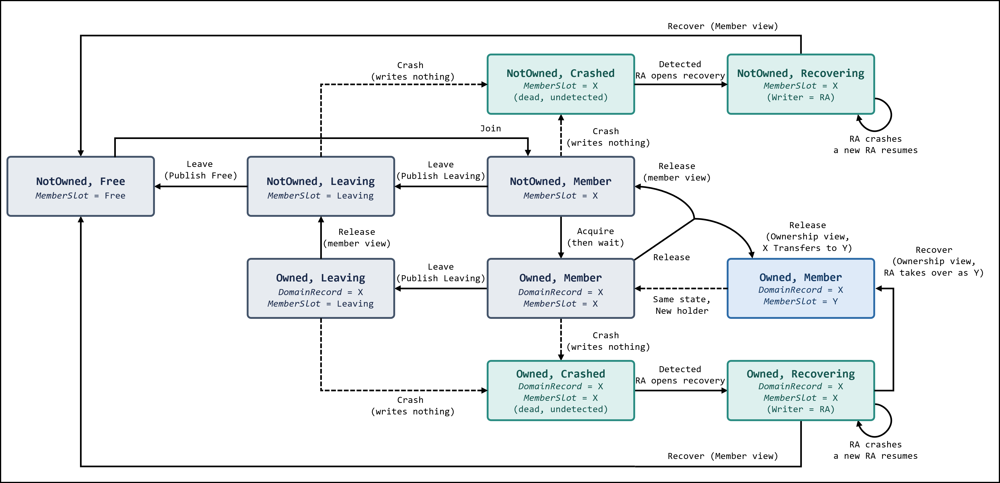

> **Figure 4-1.** A peer's composite state machine: the pair (ownership, member). A peer joins
> (Free→Member), acquires a domain (NotOwned→Owned), releases it (Owned→NotOwned), and leaves in two
> writes (Member→Leaving→Free) with any held domain released in between; Crash freezes the pair from
> either Member or Leaving, Detect moves it to Recovering, and Recover transfers any owned domain
> away and scrubs the slot.

Reading it:

- A peer joins (`Free` → `Member`), acquires a domain (`NotOwned` → `Owned`), releases it (`Owned` → `NotOwned`), and leaves (`Member` → `Leaving` → `Free`, [§4.4](#44-member-states)).
  Owning is orthogonal to living: a peer is a `Member` whether or not it owns the domain.
- Ownership moving to another peer is *that* peer's `Acquire` (`NotOwned` → `Owned`) paired with this peer's `Release` — one hand-off seen from two sides, not a new state.
- `Crash` freezes the peer at its current pair (record and slot unchanged); `Detect` then moves the member component to `Recovering`, and recovery transfers any owned domain away (`Owned` → `NotOwned`) and scrubs the slot to `Free`.

Arrow convention: a solid arrow is a write by the state's single writer; a dashed arrow writes nothing.
`Crash` is dashed — record and slot read exactly as before, so a crashed owner still reads `Owned`; it is detection, not the crash, that opens recovery.
Domain creation and deletion are not this machine's events; they belong to the control domain ([§5.3](#53-domain-types)).

### 4.7 Invariants

*Within this state machine*, two of the core requirements ([§3.3](#33-core-requirements)) — exclusive ownership (*R1*) and continuity of authority (*R2*) — hold *by construction*, so the machine keeps no invariant for them — it takes them as given and builds on them.
The construction works at two levels:

- **Structural uniqueness.** The *DomainRecord* names at most one owner and is read directly, so a second owner cannot even be expressed — neither possession, history, nor local belief confers anything; a crashed owner *remains* `Owned` until recovery transfers the domain away, and a published transfer is never retracted.
- **Protocol exclusivity.** That only the named owner — or the RA standing in once the owner is `Recovering` ([§4.4](#44-member-states)) — actually *writes* the record and its payload is not the representation's gift but the transfer discipline's; and *establishing* what that discipline assumes — a vacated record not seizable, the next owner the policy's choice, a peer declared dead truly stopped — is a core and policy guarantee ([§6.3](#63-policy-requirements), [§7.2](#72-the-fencing-boundary)), not a free consequence of the representation.

What the machine must *actively* maintain — the invariants model-checked in [§8](#8-formal-modeling-tla) — both concern recovery:

- ***I1 — Authority never strands.*** A dead holder stays in the recovery pipeline until its domains are taken over, so authority never silently evaporates — while any peer remains to do the taking over (checked as an invariant, [§8.3](#83-invariants)).
- ***I2 — Recovery completes.*** Once a *MemberSlot* enters `Recovering`, it eventually reaches `Free`, the dead peer's domains passing to live hands on the way (checked as a temporal property under fairness, [§8.4](#84-abstractions-and-limits)).

How each requirement of [§3.3](#33-core-requirements) closes — by construction, by this invariant, or by a policy contract — is argued end-to-end in [§11.6](#116-meeting-the-requirements).

---

## 5. Architecture

*Chapter 4 defines the machine; this chapter builds the peer that runs it.*

Chapter 4 gave the ownership machine as a spec — its states, its events, its invariants — without saying what makes a transition happen.
This chapter is the realization: the per-peer framework that fires those events and upholds those invariants.
Every component below exists to originate or complete a [§4](#4-state-machine) event, or to keep an invariant true.
[§5.1](#51-layering) lays the framework out in parts and shows how they connect; [§5.2](#52-component-roles) gives each part's role; [§5.3](#53-domain-types) covers the two domain types — data and control — and how the control domain governs the lifecycle of the rest.

### 5.1 Layering

The state machine ([§4](#4-state-machine)) says which transitions are legal and who may write; it does not say what makes them happen.
Some events have an obvious trigger: the peer's own application asks for them through the Public API.
Others have no caller.
A crash is an event of the environment; the dead peer cannot request its own detection or recovery, and the model ([§3.2](#32-system-model)) offers nothing to fire them — no coordinator, no notification.
And an API request need not finish at once: an `acquire` waits for a hand-off it cannot force.
Both cases need the same thing — something on each peer that acts on its own, by observation.
That is the **Coordination Engine**, a per-peer *autonomous driver*: autonomous because nothing external drives it, a driver because it is what makes the machine's events happen.
It *effects* the machine's transitions — those the API asks for and those it must originate itself — and *consults* the pluggable policies (liveness, successor, recovery authority) for the decisions it does not make.
It is an orchestrator, not an abstraction the policies sit under.
All state lives in the geometry over shared memory — *MemberSlot*s and *DomainRecord*s.

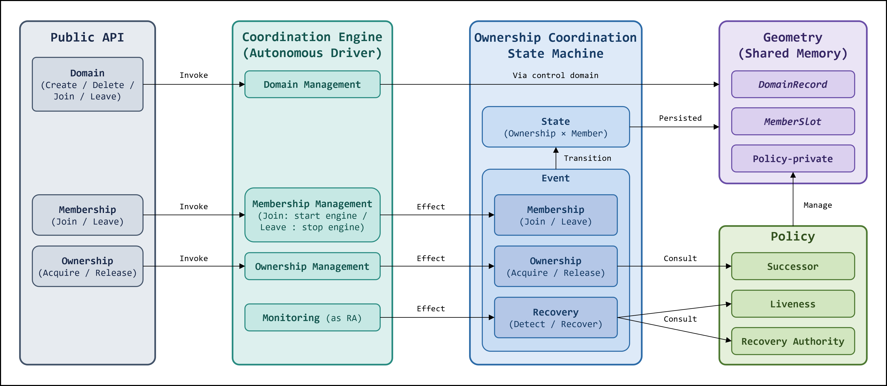

> **Figure 5-1.** The framework in five parts. The Public API (Domain create/delete/join/leave,
> Membership join/leave, Ownership acquire/release) is what a peer requests. The Coordination
> Engine is the per-peer autonomous driver — domain management, membership management (join
> starts the engine, leave stops it), ownership management, and monitoring as RA — that effects
> the State Machine's events. The Ownership Coordination State Machine defines the state
> (ownership × member) and its events (membership Join/Leave, ownership Acquire/Release, recovery
> Detect/Recover), materialized in the Geometry (DomainRecord, MemberSlot). The pluggable Policies
> (Successor, Liveness, Recovery Authority) answer the decisions the engine does not make itself.

### 5.2 Component roles

At the center is the **State Machine** — the states and events themselves ([§4](#4-state-machine)).
Around it: a **substrate** that holds its state, the **Coordination Engine** that drives its transitions, and the **pluggable policies** that decide what the engine leaves open.

| Layer | Component | Role |
|---|---|---|
| **State Machine** | ([§4](#4-state-machine)) | The states and events themselves — ownership × member and the transitions among them. The other parts hold, drive, and decide it; detailed in [§4](#4-state-machine) |
| **Substrate** | Geometry | The layout of shared memory — where every *MemberSlot*, *DomainRecord*, and policy-private area lives. The only part that knows byte offsets; everything above addresses state through it |
| **Coordination Engine** | Membership management | Publishes this peer's presence and heartbeat, admits joiners into free slots, and tracks who is present |
| | Ownership management | Acquires and releases a domain through the policy, which passes ownership to the next owner. Writes only records it owns |
| | Monitoring and recovery | Each peer's RA duty: watch the peer it is the *Recovery Authority* for and, once that target is detected dead, take over its domains and scrub its slot ([§7.1](#71-the-recovery-procedure)) |
| | Domain management | Create and delete, serialized on control-domain ownership ([§5.3](#53-domain-types)) — not a separate write path, just ownership applied reflexively |
| **Policies** (pluggable) | Successor | "Who next?" on release and on request arrival |
| | Liveness | Judges whether a peer has failed |
| | Recovery Authority | Names each peer's RA — a standing assignment |

### 5.3 Domain types

CME has two kinds of domain.
A **data domain** is what an application creates and coordinates over — every domain in [§4](#4-state-machine) was one.
The **control domain** is the single domain that exists before any other and governs them all: the same ownership machinery applied reflexively to the metadata naming which data domains exist.

A data domain's lifecycle is not a separate mechanism: it runs under control-domain ownership.
One mechanism, no special metadata lock, and the lifecycle races close by construction.

---

## 6. Coordination Policies

*Three questions the core refuses to answer itself — who's next, who's dead, who recovers it — and the contract that makes any answer safe.*

Waiting, ordering, and failure handling are not the core's; they are the concern of three pluggable policies it consults.
This chapter says why the decisions are delegated rather than fixed ([§6.1](#61-why-a-policy-abstraction)), the contract every policy obeys ([§6.2](#62-the-policy-contract)), and the requirements and desirable properties each one carries ([§6.3](#63-policy-requirements)).

### 6.1 Why a policy abstraction

Delegating these decisions to policies is the right move, not a dodge.
The boundary earns its keep several ways:

1. **No universal best.** No single policy fits every deployment — successor selection, for example, carries opposite fairness/latency tradeoffs across environments ([§10.1](#101-successor-selection-design-space), [§11.3](#113-policies-compared)) — so baking one in would be wrong for most, and CME cannot know the deployment in advance.
2. **No safety cost.** At most one owner holds a domain whatever the answer, so a policy's answer is free to vary without reopening correctness.
   A decision with no universal answer and no safety consequence is exactly the one to hand out.
3. **Formal verification.** Modeling the choice as a nondeterministic oracle ([§8.4](#84-abstractions-and-limits)) lets TLC verify the core *once* for all policies: it explores every choice any policy could make, so a new policy cannot break safety — only performance and liveness-shape.
   Without the abstraction, every strategy would need its own proof.
4. **Comparability.** One state machine, one test/bench harness, different policies: every number in [§11](#11-evaluation) varies only by the policy, and every fairness/starvation claim is checked under an identical workload.
   Isolating the policy makes it the only variable, so the abstraction is a *measurement instrument*, not just an architecture choice.

### 6.2 The policy contract

The engine consults three pluggable policies ([§5.2](#52-component-roles)) for the decisions it does not make itself, and holds each to the same contract:

| Policy | Question | Answer |
|---|---|---|
| **Successor** | *Who's next?* | Hands a released domain to its next owner, or to none |
| **Liveness** | *Who's dead?* | A verdict — a peer is alive, or failed |
| **Recovery authority** | *Who recovers it?* | Names exactly one recoverer per dead peer |

A policy answers its question and nothing more; the core owns every mutation of authoritative state.
A policy changes ownership only through the core's guarded transfer primitives — take over, hand off, vacate — never a raw write to a *DomainRecord*, so the single-owner invariant holds whatever the policy decides.
Each policy keeps whatever private state its answer needs in its own single-writer area of the geometry ([§5.1](#51-layering)); the core neither reads nor maintains it, and on recovery the policy clears a dead peer's share through one hook the core calls per recovered peer ([§7](#7-recovery)).
The surface is deliberately this thin: any mechanism meeting the contract plugs in, from a token ring to a hardware lock — so no-atomics and no-coordinator are properties of the policies measured here, not of the framework.

### 6.3 Policy requirements

Each policy is held to a contract ([§6.2](#62-the-policy-contract)).
A **requirement** is load-bearing for correctness — the framework's guarantees (*R1*–*R3*) fail if it is violated — while a **desirable** property only improves quality (fairness, latency, availability under partial failure) and is tuned per deployment.
Two entries fall outside both: one obligation CME **delegates** to the platform, and one property that looks necessary but is **not required**.

| Policy | Class | Property | What it means |
|---|---|---|---|
| **Successor** | Requirement | Progress | A live requester eventually obtains ownership (the acquisition half of *R3*) |
| | Desirable | Validity | Pick a currently-live member. A stale pick is safe — recovery re-homes a domain handed to a since-dead peer — but wastes a recovery cycle |
| | Desirable | Fairness / latency | Bounded wait, no starvation, and low hand-off cost |
| **Liveness** | Requirement | Completeness | Every crash is eventually declared dead; without it recovery never fires and *R3* progress is lost |
| | Desirable | Accuracy | Few false positives — a false positive costs a spurious recovery and a healthy peer's availability, not correctness; traded against timeliness at the timeout operating point |
| | Desirable | Timeliness | Detect crashes promptly — until a crash is detected the dead owner's domains are stranded and acquirers stall, so coordination pauses for them |
| | Desirable | Stability | Few verdict flips, so less churn |
| | Delegated | Crash-stop enforcement | A peer declared dead (false positive included) must be made to truly stop, or a live "dead" peer and its recoverer write one record at once. CME decides; the platform fences ([§7.2](#72-the-fencing-boundary), [§A](#appendix-a--fencing-over-non-coherent-memory)) |
| | Not required | Agreement | Peers need not agree on who is dead; only a dead peer's RA acts on its own judgment, and a peer that disagrees does nothing |
| **Recovery authority** | Requirement | Uniqueness | Exactly one RA per dead peer at any instant; two would write the *DomainRecord* at once |
| | Requirement | Availability | Eventually some RA exists, or the dead peer is never recovered and *R3* fails |
| | Requirement | Determinism | From a given membership view every peer derives the same RA — a pure function of membership, not an election. The transient stale-view window is closed by the claim ([§10.4](#104-recovery-authority)) |

---

## 7. Recovery

The policies settle two questions about recovery — *when*, and *who*.
This chapter is the third: *how*.
**Liveness** decides when, by declaring a peer dead ([§6.2](#62-the-policy-contract)).
The **recovery authority (RA)** decides who, naming exactly one recoverer per dead peer at any instant.
Both belong to [§6](#6-coordination-policies); how the chosen peer recovers is this chapter.

Recovery is not an add-on to the live path.
It is why ownership lives in a durable published record rather than a transient lock ([§2.2](#22-first-reframing-ownership-coordination-protocol)): ownership can outlive the peer that holds it, so someone must take it over.
Chapter 4 gave recovery as events and invariants only — `Detect`, `Recover`, and the guarantee that recovery completes (*I2*).
This chapter is the mechanism behind them: the failure path, which the live path ([§6.2](#62-the-policy-contract)) never touches.

One rule holds throughout: every recovery step reuses the *same* primitives as the normal path — ownership transfer, single-writer records.
Even the claim that makes the RA unique belongs to the RA policy, as the second half of its decision ([§10.4](#104-recovery-authority)); the procedure below starts with it already settled.
An RA moves a dead peer's record the same way a release moves a live one, so recovery adds no second record-transfer model to verify.

### 7.1 The recovery procedure

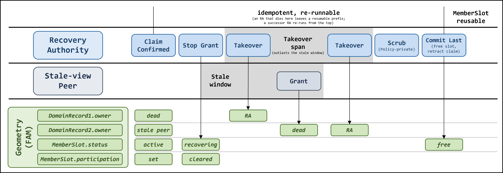

> **Figure 7-1.** Recovery sequence — one recovery as a swimlane. Three lanes: the Recovery
> Authority on top, a stale-view peer in the middle, and the FAM truth every arrow writes at the
> bottom (the dead peer's domain record, a second domain record owned by the stale-view peer, and
> the dead peer's slot status and participation, each on its own timeline rail). Entering with the
> claim confirmed ([§10.4](#104-recovery-authority)), the RA stops grants — the slot is seized to
> Recovering and participation cleared in the same step — then takes over the dead peer's domain
> across a takeover span that outlasts the stale window ([§3.2](#32-system-model)): mid-span the
> stale-view peer grants its own domain to the dead peer, and a later takeover turn re-seizes it.
> Policy-private scrub follows, and the slot commit to Free is written last — the readmit gate —
> retracting the claim words with it. Everything left of the commit line is idempotent and
> re-runnable: an RA that dies there leaves a resumable prefix a successor RA re-runs from the
> top; right of it the slot is reusable.

Holding the claim ([§10.4](#104-recovery-authority)), the RA runs a fixed sequence:

1. **Stop grants.** Seize the dead peer's *MemberSlot* to `Recovering` — the core-visible marker that recovery is in progress, which drops the peer from RA selection (a losing RA stops choosing it) and, since only `Free` slots are re-admitted, bars slot reuse for the duration — and clear its participation.
   Every successor policy checks participation before granting, so this alone stops any new ownership from being handed to the dead peer while recovery runs; it also keeps orphan detection from miscounting the dead peer as a live participant.
   Participation is cleared before the *MemberSlot* is freed (step 4) — a freed *MemberSlot* still naming a participant is the phantom-participant ordering TLC checks.
2. **Takeover.** The dead peer's *DomainRecord* still names it owner, so the domain is stranded — no live peer can acquire what a dead one holds, and *R3*'s progress guarantee fails.
   The RA takes ownership by an ordinary transfer, then releases it normally.
   Because a peer whose view is still stale may re-grant a domain to the dead peer even after step 1, takeover is not a single act: it repeats over a span that outlasts the staleness window ([§3.2](#32-system-model)), re-seizing any domain a late grant re-dirties before the sequence commits (step 4).
   Recovery does not choose the successor; it makes the domain live again and lets the policy re-home it on the normal path — which is why takeover reuses the ordinary transfer primitive rather than a special recovery write.
3. **Policy scrub.** The policy may keep private FAM state keyed to the dead peer that the generic record takeover cannot see.
   Left behind it deadlocks a live sibling or degrades a group, so recovery calls the policy's hook to clear it.
   Only the policy knows its own layout; the core stays blind.
4. **Commit last.** Setting the *MemberSlot* status to `Free` (`Member_t::Status::None` in the implementation) is the single commit point, and it doubles as the **readmit gate** — admission reuses only `Free` slots, so the dead peer's ghost identity cannot be revived through slot reuse before the scrubs above complete.
   The RA then retracts its own claim word ([§10.4](#104-recovery-authority)).
   Because `Free` is written last and every earlier step is idempotent and re-runnable, an RA that dies mid-recovery leaves a resumable prefix: a successor RA re-runs the sequence from the top ([§8.4](#84-abstractions-and-limits)).

An RA is a peer, so it too can die mid-recovery.
The dead RA is itself recovered like any peer, while membership re-derivation hands the original dead peer a new RA that re-runs the idempotent sequence.

### 7.2 The fencing boundary

Perfect failure detection is impossible: no detector over shared memory can be both complete and never wrong ([[26]](#references); [§10.3](#103-liveness-failure-detection)).
The model steps around this by assuming crash-stop — a peer declared dead has truly stopped ([[33]](#references); [§3.2](#32-system-model)).
Reality does not grant that assumption for free: a peer wrongly declared dead may still be alive and writing, putting a second writer on its *DomainRecord* alongside the RA.
Making the assumption true takes a **fencing** mechanism — one that forces a declared-dead peer to actually stop.

CME cannot provide it.
Over shared memory a peer writes to any line it has mapped, and no peer-level protocol can take that access away — only the platform that owns the mapping can revoke it.
[§A](#appendix-a--fencing-over-non-coherent-memory) explains why the usual message-passing fences — lease self-expiry ([[29]](#references)), quorum view change ([[31]](#references)), network kill — do not transfer to non-coherent memory.
So the boundary is explicit: **CME decides who is dead; the platform enforces the stop** — FAM revoke (marufs), named here and left unimplemented ([§14](#14-conclusion)).

What CME does do is make the aftermath clean.
Recovery scrubs the dead peer's state and frees its *MemberSlot* (status `Free`, the readmit gate, [§7.1](#71-the-recovery-procedure)), so once the platform has fenced the peer, nothing stale blocks it from rejoining under a fresh identity.

---

## 8. Formal Modeling (TLA+)

*This chapter is for readers interested in the formal specification and correctness of the coordination model.
The implementation ([§9](#9-implementation-notes)) can be read independently of it.*

The TLA+ model is the source of truth for protocol semantics: a change that touches semantics is reflected here and re-checked.
The point of this chapter is narrow and concrete — the state machine of [§4](#4-state-machine) is transcribed directly into the model, its objects becoming the state, its events the transitions, and its invariants ([§4.7](#47-invariants)) the checked properties — after which the deliberate abstractions and the limits of the checking are stated plainly.
The core model is [§4](#4-state-machine) and nothing more: the two coupled machines over the *DomainRecord* and the *MemberSlot*, with no control/data split, no create/delete, no participation tracking, and no notification transport — those belong to later chapters.

### 8.1 Variables and states

Three variables carry the whole machine:

| Object (§4) | TLA+ Variable |
|---|---|
| *DomainRecord* — the owner ([§4.1](#41-the-domainrecord-and-the-memberslot)) | `DomainRecord[domain]` (a peer) |
| *MemberSlot* status ([§4.4](#44-member-states)) | `MemberSlotStatus[peer] ∈ {Free, Member, Leaving, Recovering}` (Crashed derived) |
| ground-truth liveness (environment) | `alive[peer]` |

Ownership ([§4.3](#43-ownership-states)) is read straight off the record; the member states ([§4.4](#44-member-states)) are read from the pair `(MemberSlotStatus, alive)` — slot status, and ground-truth liveness (`alive` is the oracle's flag, not a slot write).
Each state is one predicate:

| State ([§4.3](#43-ownership-states)–[§4.4](#44-member-states)) | TLA+ Predicate |
|---|---|
| `Owned`(domain, peer) | `DomainRecord[domain] = peer` |
| `NotOwned`(domain, peer) | `DomainRecord[domain] ≠ peer` |
| `Free`(peer) | `MemberSlotStatus[peer] = Free` |
| `Member`(peer) | `MemberSlotStatus[peer] = Member ∧ alive[peer]` |
| `Leaving`(peer) | `MemberSlotStatus[peer] = Leaving ∧ alive[peer]` |
| `Crashed`(peer) | `MemberSlotStatus[peer] ∈ {Member, Leaving} ∧ ~alive[peer]` |
| `Recovering`(peer) | `MemberSlotStatus[peer] = Recovering` |

`Crashed` is not a stored value: death writes nothing to the slot (it stays `Member`, or `Leaving` if the peer was part way through its exit); only `alive` drops.

### 8.2 Events

Each event of [§4.5](#45-events) becomes one action per FAM write, carrying its full content — the transition, the guard that enables it, and what it writes — not merely a name.
Per write, because a crash lands only between writes: an event folded into one action hides the states it leaves part way through.
`Leave` and `Recover` are the two events that span more than one.

| Event ([§4.5](#45-events)) | Transition | Enabled when (TLA+ Guard) | Writes | TLA+ Action |
|---|---|---|---|---|
| *Join* | member: `Free → Member` | a `Free` peer, alive, and no lower slot is `Free` | `MemberSlotStatus[peer] ← Member` | `JoinMembership(peer)` |
| *Leave* — publish `Leaving` | member: `Member → Leaving` | a `Member`, alive, and another peer is still a `Member` ([§8.4](#84-abstractions-and-limits)) | `MemberSlotStatus[peer] ← Leaving` | `BeginLeave(peer)` |
| *Leave* — publish `Free` | member: `Leaving → Free` | `Leaving`, and holds nothing | `MemberSlotStatus[peer] ← Free` | `PublishNone(peer)` |
| *Acquire* / *Release* | ownership: `from → to`, member unchanged | `from`: a `Member` or a `Leaving` peer, holds the domain<br>`to`: any `Member` | `DomainRecord[domain] ← to` | `PublishOwnership(domain, from, to)` |
| *Crash* | freezes the pair | a `Member` or a `Leaving` peer, and another `Member` remains | no *DomainRecord* or *MemberSlot* write<br>(only `alive[peer] ← FALSE`, an oracle flag) | `Crash(peer)` |
| *Detect* | member: `Crashed → Recovering` | a live peer (the oracle's RA, [§8.4](#84-abstractions-and-limits)); the dead peer's slot still `Member` or `Leaving` | `MemberSlotStatus[dead] ← Recovering` (seizes the slot; the sole recovery marker) | `SeizeRecovery(ra, dead)` |
| *Recover* | ownership: `→ RA`, then member: `Recovering → Free` | any live peer (the oracle — a later RA may finish what a dead one started); the dead peer still names the record; its every domain taken over | `DomainRecord[domain] ← ra`; then `MemberSlotStatus` scrubbed to `Free` | `TakeoverOwnership(domain, ra, dead)` + `CompleteRecovery(ra, dead)` |

`Crash` is permanently enabled for any peer, the RA included; the invariants must hold in every interleaving of work and death.
Read as the composite ([§4.6](#46-the-composite-machine)), the pair `(ownership, member)` moves by exactly these steps: a live holder hands a domain off in one record write, a crash freezes the pair, detection opens recovery.

### 8.3 Invariants

The machine invariants of [§4.7](#47-invariants) map — *I1* directly to a checked predicate, *I2* only conditionally ([§8.4](#84-abstractions-and-limits)).
One shorthand:

- `PendingRecovery(peer) == MemberSlotStatus[peer] ∈ {Member, Leaving, Recovering} ∧ ~alive[peer]`

| Invariant ([§4.7](#47-invariants)) | TLA+ invariant | Condition |
|---|---|---|
| *I1* — authority never strands | `DeadHolderPending` (INVARIANT) | `∀ domain : ~alive[DomainRecord[domain]] ⇒ PendingRecovery(DomainRecord[domain])` — a dead holder is always in the recovery pipeline, never stranded |
| *I2* — recovery completes | `RecoveryTerminates` (PROPERTY, under `FairSpecRF`) | `∀ peer : Recovering ~> Free` — every seized slot eventually reaches `Free`, by *any* live peer, so an RA dying mid-recovery leaves a resumable target, not a stranded one. Checked under weak fairness on the recovery actions plus a recovery-first schedule ([§8.4](#84-abstractions-and-limits)) |
| | deadlock-freedom (`CHECK_DEADLOCK`) | structural side-check: every reachable state has a successor, so recovery can never wedge. Not a completion proof — a behavior can defer recovery forever without deadlocking; completion is `RecoveryTerminates`'s to check |

One well-formedness invariant is checked alongside: `RecoveringTargetsDead` (`∀ peer : MemberSlotStatus[peer] = Recovering ⇒ ~alive[peer]`) — only a dead member is ever seized, so a live peer is never recovered.
This is the crash-stop consistency that *R1* leans on in the recovery path: recovering a still-live owner would put a second writer on its domain, breaking exclusive ownership.
It is *not* a §4.7 invariant, though: that a peer declared dead is *truly* stopped is the crash-stop assumption ([§7.2](#72-the-fencing-boundary)) — enforced by platform fencing, not proven here — so this checks that the model's encoding of that assumption stays consistent, rather than proving it against an adversary.

### 8.4 Abstractions and limits

Six abstractions let the core stand for every implementation, not one:

- **Policy is a nondeterministic oracle.** A successor is *any* member — alive or not, since the handing holder cannot verify a successor's liveness and a since-crashed successor merely names a dead holder that recovery takes over — and an RA is *any* live peer.
  The RA oracle absorbs the claim: the LWW arbitration that narrows contenders to one winner is policy-private mechanism ([§10.4](#104-recovery-authority)), so its single-winner correctness is a policy-layer obligation, not model-checked here.
  TLC explores every choice, so one proof over the oracle covers every policy for its *core* interactions.
  It also carries one action with no event of its own, since it moves neither component of the pair: a stopped process restarts on an already-scrubbed slot before re-entering through `Join`.
- **A member always remains.** `Leave` is enabled only while another peer is still a `Member`, so the region never empties in the model.
  An implementation cannot refuse the last exit, and what it does instead — leave the record on the slot the next joiner will claim, and let re-admission rather than recovery pick it up ([§10.2](#102-successor-selection-implementation)) — is a policy obligation like the vacant record above.
  Its guard is that admission reserves the *lowest* free slot, so the parked record and the next joiner meet on the same one.
- **The successor filter is atomic here and bounded-stale in the implementation.** The model picks a successor among peers reading `Member` *at the instant of the record write*, so no hand-off ever lands on a peer that has begun leaving.
  Figure 4-1 has no `NotOwned, Leaving → Owned, Leaving` arrow for that reason.
  An implementation reads membership through a cache and can be preempted between the read and the write, so it has that arrow.
  Hence the two things the model needs no part of: a departing peer stays able to release what it holds rather than freeing its slot first, and it waits before it does ([§4.4](#44-member-states)).
- **Ownership moves are named transfers.** `PublishOwnership` and `TakeoverOwnership` move the record peer-to-peer; a release that instead vacates the record — leaving it briefly naming no one until the policy's arbitration winner stamps it ([§4.5](#45-events), [§10.2](#102-successor-selection-implementation)) — is not in the model.
  Its guards — exclusivity of the stamp, and cleanup of a death inside the window — are policy obligations, like the claim's single winner above.
- **Failure detection is crash-stop.** `Detect` fires only on a genuinely dead peer; detection latency and false suspicion stay out of the model, resting on the same fencing assumption as `RecoveringTargetsDead` above.
- **Only writes to authoritative state are actions.** The implementation also writes replica records, epochs and local belief, and each publish touches more than one line.
  None is authoritative: a reader confirms against the truth record, so a stale or torn replica costs it a poll, never a wrong holder ([§9](#9-implementation-notes)).
  So those publishes fold into the single truth write the model has — and a crash *between* the replica and the truth write is outside it by that assumption.
  The frontier scan that repairs such a tear is implementation machinery for a case the core does not admit.

**Liveness: recovery completes (conditionally).** The safety invariants ([§8.3](#83-invariants)) hold in every behavior.
Recovery *completing* (*I2*) is different: a `leads-to` property (every seized `Recovering` slot eventually reaches `Free`), it holds only under fairness (a ready recovery step is not ignored forever) and bounded churn.
Model-checked with weak fairness on the recovery actions, it holds under a *recovery-first* schedule — while a recovery is pending, the normal workload yields to it.
Without that constraint, competing actions can keep recovery from ever running, so a seized slot never clears.

So recovery-completion is *conditional* — it holds once churn subsides (eventual quiescence), not against an adversary that crashes forever, which no protocol survives.
The recovery-first schedule is the modeling device expressing "a recovery burst runs to completion before new churn." Deadlock-freedom remains the unconditional, safety-level guarantee that recovery is never *stuck*, only possibly deferred.

---

## 9. Implementation Notes

*How the implementation preserves the machine's invariants where a peer is not atomic and a record write is not atomic — under one organizing rule: one writer per cacheline.*

The idealized machine ([§4](#4-state-machine)) treats a peer as a unit and its record write as atomic.
The medium grants neither for free — a store's visibility is manual and stale-prone ([§9.2](#92-coherency-operations-and-the-wbuc-regimes)), a logical update that spans several lines is not jointly atomic ([§9.4](#94-shadow-domain-records-distribution-without-a-second-truth)), and there is no cross-host lock to paper over the gap.
This chapter records how the implementation upholds both idealizations anyway, preserving the machine's invariants (*R1*, *R2*, *I1*, *I2*), organized by one rule: who may write each cacheline, and when.

### 9.1 One writer per cacheline

Non-coherent shared memory offers no cross-host atomics and no cache protocol to serialize concurrent writers.
The implementation does not try to supply one.
It lays the region out so that, at any instant, each cacheline has exactly one writer.
A store then needs no lock, because no second writer exists to race it.
And a reader never sees a half-written record: an aligned 64-byte line is read and written as a single fabric transaction ([§9.2](#92-coherency-operations-and-the-wbuc-regimes)), so the device serializes a concurrent read against the write and the reader observes the whole line — the old value or the new one, never a mix of fields.
Whole-line `get`/`set` is in this sense single-copy atomic, and that is all a publish or a snapshot needs.

What it is *not* is a read-modify-write primitive: two writers racing `get`→modify→`set` would each read, mutate locally, and store back, losing an update.
That case is exactly what the single-writer rule forbids, and where two peers genuinely must contend for one line, the last-writer-wins exceptions ([§9.3](#93-last-writer-wins-where-a-single-writer-is-impossible)) handle it without relying on atomicity at all.
Note that single-transaction wholeness is a platform property of aligned full-line access, not an x86 architectural guarantee — so the single-writer discipline, not the transaction, is what ultimately keeps the protocol correct.
What no single line gives is atomicity *across* lines: a publish spread over two lines (shadow then truth, [§9.4](#94-shadow-domain-records-distribution-without-a-second-truth)) is two transactions, and the reader may catch them out of step.

Writership is not fixed — it moves — but only by an act of the current writer (a hand-off) or, for a dead writer, by the Recovery Authority under a claim.
The table is the map: for the principal line classes, who writes each on the normal path, who may write it during recovery, and who reads it.

| Cacheline | Holds | Normal writer | Recovery writer | Readers |
|---|---|---|---|---|
| active *MemberSlot*[peer] | status, heartbeat, participation | that peer only | RA (scrub to *None*) | all peers |
| active *DomainRecord*[domain] | ownership: holder + epoch | the domain's holder | RA (under claim) | adopters |
| *RecoveryClaim*[peer] | the recovery-right claim | — | contending RAs → recovering RA | RAs |
| *AdmissionControl* + inactive *MemberSlot* | nonce lease; the slot being claimed | contending joiners → lease holder | lease stealer | joiners |
| *Header* + inactive *DomainRecord* | the domain set: active bitmap + record state/name | the control-domain holder | — | all peers |

A line's writer can shift with its lifecycle phase.
An *inactive* (unclaimed) *MemberSlot* is written by the admission lease holder that claims it, and an *inactive* *DomainRecord* by the control-domain holder that creates or deletes it — each a single serialized writer, distinct from the peer or holder that owns the *active* line.

The two rows with contending writers are the deliberate exceptions: where peers genuinely race for one line, last-writer-wins resolves the race — the subject of [§9.3](#93-last-writer-wins-where-a-single-writer-is-impossible).

### 9.2 Coherency operations and the WB/UC regimes

A record access is always a whole 64-byte line, never a single field.
Four things make that access correct and cheap:

- **Whole-line AVX-512 load/store.** A read or write is one aligned `zmm` (512-bit) instruction — a single fabric transaction, not eight.
  On UC a partial write is a read-modify-write in the memory controller, so a 64-byte store is *cheaper* than a 4-byte one; records are line-sized for this reason.
- **64-byte alignment.** Every line sits on a cacheline boundary (the region layout guarantees it, checked at bind), so a whole-line access is one transaction and never straddles two lines.
- **A barrier.** Each access is paired with a fence — `wmb` after a write, `rmb` before a read — the ordering the medium does not give for free.
- **Flush or UC, per regime.** Cross-host visibility is not automatic; how it is achieved is the build and mapping choice:
    - *write-back (WB)* — the barrier also flushes: `clflushopt` or `clwb` on the writer, `clflush` on the reader;
    - *uncached (UC)* — the cache is bypassed, so the barrier does no flush.

For state written often and read across hosts — coordination metadata, communication lines — caching earns nothing: there is no reuse to amortize, only a flush to pay on every access.
UC, which never caches, wins for this workload.
A per-instruction microbenchmark on this bench (one cacheline, warm loop) shows the gap:

| ns | 8B×8 load | 64B load | clflush + load | 8B×8 store | 64B store | store + clwb | store + clflushopt |
|---|---|---|---|---|---|---|---|
| **WB** | — | — | 566.2 | — | — | 225.2 | 681.7 |
| **UC** | 1966.1 | 242.9 | — | 1667.4 | 185.1 | — | — |

Two things stand out.
The 64-byte AVX-512 access is ~8× the eight-`mov` path on UC (242.9 vs 1966.1 ns for a load, 185.1 vs 1667.4 ns for a store) — one transaction, not eight.
And WB has to carry a flush on every access, which costs more than the uncached access it would replace: UC's 185.1 ns store beats WB's cheapest flushed store (225.2 ns with `clwb`, 681.7 ns with `clflushopt`), and the same holds for loads (242.9 ns UC vs 566.2 ns for `clflush` + load).

### 9.3 Last-writer-wins, where a single writer is impossible

Two things cannot have one pre-assigned writer, because the whole point is that two peers may reach for the same thing at once: a joiner claiming a *MemberSlot*, and a Recovery Authority claiming a dead peer.
For these the implementation drops to last-writer-wins (LWW) over a single word — atomic-free, since there is no cross-host CAS — and makes the race *outcome* safe rather than preventing the race.
Neither is a break taken by choice: the single-writer rule of [§9.1](#91-one-writer-per-cacheline) cannot hold here — the situation forces contention, as each bullet explains.
Both are confined to one word.

- **Admission — the nonce lease.** Once a peer is a member it owns its *MemberSlot* outright, a single writer by [§9.1](#91-one-writer-per-cacheline).
  Claiming that slot in the first place happens *before* membership: the joiner owns nothing yet, so it cannot `lock`, and several joiners may reach for the same free slots at once.
  That contention needs its own arbitration point — a separate cacheline, *AdmissionControl*, holding a nonce lease.
  The joiner stakes a random nonce, waits one settle interval, then re-reads: if its nonce survived it holds the lease, if not it lost and retries.
  A lease left unchanged for a fixed steal window is presumed dead and stolen, so a crash mid-claim never wedges later joiners.
  Holding the lease, the joiner reserves the lowest free slot.
- **Recovery — the claim.** Which peer is a target's RA is derived from membership — under a ring-order policy, for instance, its ring neighbour — and membership shifts as peers join and leave.
  So during churn two peers can transiently each see themselves as the RA for the same dead target, with no pre-assigned writer to defer to.
  Last-writer-wins collapses them to one: an RA stakes its identity over the target's *RecoveryClaim* word — only where a fresh read shows it free or naming a dead RA — then re-reads after a settle to confirm it survived (the same stake-and-confirm shape as admission).
  The survivor runs the recovery; the loser backs off ([§10.4](#104-recovery-authority)).
  Crash-stop plus silence-timeout detection already make a genuine double-RA rare; LWW covers the transient overlap churn can still produce.

Both breaks are then one primitive: an atomic-free single-word write, followed by a settle-and-re-read that names the survivor.
The *last* in last-writer-wins is well-defined for the same reason a whole-line access is atomic ([§9.1](#91-one-writer-per-cacheline)): every contender writes the one word, so the memory controller serializes those writes into a single order with a definite final value, and the re-read observes it — no cross-host CAS needed.
Each break is confined to its one word and touches no single-writer line above.

### 9.4 Shadow domain records: distribution without a second truth

A domain's ownership is in one *DomainRecord*: one line, one writer (its holder), one truth.
But every waiter must observe a hand-off promptly, and pointing them at the single truth line has three costs.
First, poll-based notification is inherently a write-read race: the holder writes the line to publish a hand-off while waiters poll it to notice, and a UC read overlapping a write runs 370–470 ns instead of ~335 ns, a 40–140 ns penalty plus a tail (measured, one writer against one polling reader).
Second, that cost multiplies: measured same-host, UC read p50 grows 370 ns to 1.31 µs and the >1 µs tail grows from near-zero to over 99% of reads as pollers on one line go from 0 to 8 (one writer, one timed reader, up to eight extra untimed pollers on the line); *N* hosts additionally sharing fabric bandwidth with unrelated traffic would compound this further (reasoning, not yet isolated in measurement).
Third, the cost belongs to the address rather than to the load: the same eight pollers moved onto distinct lines return the timed reader to ~340 ns and a 0.04% tail, indistinguishable from no pollers at all, and no trend in poller count survives.
Single-line multi-host polling is a structural anti-pattern, not a tail to tolerate.

The fix is replication for reads only.
Each *DomainRecord* has, besides its truth line, a set of shadow lines — one per reader group.
The holder publishes a hand-off to the shadows first, then to the truth.
A waiter polls its group's shadow and, when the shadow says the domain moved, confirms against the truth before it adopts.

This does not create a second source of truth, and that is the point worth stating exactly.
No correctness decision is ever *made* against a shadow.
A stale, or even torn, shadow is only a hint that the domain may have moved; the adopt path re-reads the truth line, and the truth line alone decides.
So a shadow can lag, tear, or momentarily disagree with the truth without threatening *R1* — the worst it can do is make a waiter poll the truth one cycle early or late.
The publish order (shadow before truth) fixes the failure direction as harmless: a waiter may see a not-yet-real hand-off on the shadow and be corrected by the truth, but never sees a real hand-off on the truth that a lagging shadow hides into inaction.

This layout is the third generation of the same discipline; each step retired the one before for a reason:

- **Shared control block** — all peers poll one line.
  This is the read-storm above, so it was replaced to stop the hot-polling.
- **Per-peer doorbell slots** — strict one-writer, one-reader lines that end the storm.
  But a doorbell is a *separate* data structure: extra state the machine must carry and keep in step with the record, and that added complexity cost performance in the implementation.
- **Shadow records** (current) — a shadow is just a replicated *DomainRecord*, the *same* structure as the truth, so a reader still polls a bounded-reader line but the state machine gains no new concept and pays no per-peer signaling writes.

### 9.5 DRAM-local state

Not everything a peer knows belongs in FAM.
A large body of state is DRAM-local, and the boundary is deliberate: FAM is governed by the atomic-free single-writer protocol, while DRAM is free to use whatever concurrency tool fits, full atomics included.
This section sorts each piece of DRAM-local state into a category and gives the reason for its placement; where a piece falls follows from two questions — *who writes the FAM line?* and *can the consumer tolerate staleness?*

| # | Category | Items | Truth | Sync | Refreshed |
|---|---|---|---|---|---|
| A | DRAM truth → FAM mirror | this peer's own *MemberSlot*: status, participation, heartbeat | DRAM | DRAM→FAM, write-only | on change |
| B | Bounded-stale cache | other peers' *MemberSlot* (status, participation, heartbeat)<br>scan scope (live domains, peer-scan bound) | FAM | FAM→DRAM | lazy on miss, or periodic |
| C | No cache — fresh read | *DomainRecord*, *RecoveryClaim* | FAM | read FAM every time | always |
| D | DRAM-only | local inter-thread coordination ([§9.6](#96-poll-and-worker-threads))<br>per-peer bookkeeping (layout, config, telemetry) | DRAM | — | — |

Those two questions place every piece.
A line you alone write needs no read-back, so DRAM is its truth (A); state with no cross-host meaning never leaves DRAM (D).
The rest is caching (B) versus a fresh read (C), decided by whether a stale value can cause a wrong decision:

- **Cached (B)** where it cannot, for one of two concrete reasons.
  Either the value is re-validated at the point of use — the scan scope is re-checked entry by entry as the scan runs, and a membership-based pick is re-checked when acted on or reclaimed by recovery, so a stale read costs at most a wasted step or a joiner seen one interval late.
  Or the decision it feeds carries far more margin than the staleness: a stale heartbeat cannot fake a death because the dead-declaration threshold dwarfs the cache window, so every advance is still seen in time.
- **Fresh (C)** where a stale read would be the wrong answer outright: the *DomainRecord* settles ownership and the *RecoveryClaim* settles the recovery right, so both are read from FAM on every access.

### 9.6 Poll and worker threads

[§4](#4-state-machine) models each of a peer's actions as a single atomic event with one initiator ([§4.5](#45-events)).
The implementation is not atomic like that: two threads run inside a peer and share its DRAM-local state — the *MemberSlot* view (its own and others', [§9.5](#95-dram-local-state)) and per-domain information, which domains it wants (*pending*) and which it is actively using (*pinned*).
What lets the peer still present that single-actor behaviour is that the two threads have near-disjoint duties and meet at just one point, closed by local synchronization (below).

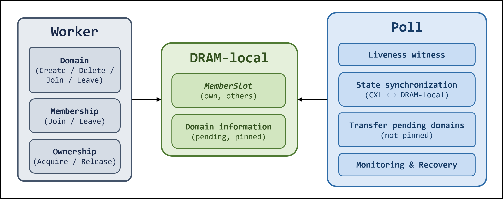

> **Figure 9-1.** The worker and poll threads of one peer, meeting through its DRAM-local state.
> The worker runs the application's foreground calls — domain create/delete/join/leave, membership
> join/leave, ownership acquire/release. The poll thread runs the autonomous work — the liveness
> witness, state synchronization between CXL and DRAM-local, transfer of unpinned pending domains,
> and monitoring/recovery. Both read and write the peer's DRAM-local MemberSlot and domain
> information.

**The worker thread** is the application-facing side.
It runs the public API and drives the foreground transitions: domain *create / delete / join / leave*, membership *join / leave*, and ownership *acquire / release*.

**The poll thread** — one per peer — drives everything autonomous, the transitions the application never asks for:

- **Liveness witness** — advances this peer's proof of life for other peers' liveness policies to observe.
- **State synchronization** — reconciles CXL and DRAM-local state: publishes this peer's, refreshes its view of others'.
- **Transfer of pending domains** — hands a domain whose use has ended (no longer *pinned*) to a peer that wants it (*pending*).
- **Monitoring and recovery** — acts as Recovery Authority: detect a dead peer, claim it, take over its domains, finalise.

The two threads contend at just one point — a domain hand-off, where the poll thread might transfer a domain a worker is still using.
Because that race is inside a single peer, not across the fabric, it is closed with ordinary local synchronization — atomic operations and a mutex, each where it fits, on DRAM.
It never touches the FAM protocol, which stays atomic-free and single-writer ([§9.1](#91-one-writer-per-cacheline)); coordinating a peer's own threads is just in-process concurrency, and the peer is free to use whatever primitive suits.

### 9.7 The control domain: self-hosting metadata

The domain *set* is itself mutable state in FAM — which domains exist, which are live — and by the rule of [§9.1](#91-one-writer-per-cacheline) it needs a single writer.
Rather than invent a second locking primitive for metadata, the implementation reuses the one it already has.
Domain 0 is a reserved *control domain*, and the right to mutate the domain set is simply ownership of it.
Creating or deleting a domain acquires it through the same successor policy as any data domain — a `lock` on the control domain — then mutates the *DomainRecord* table and the live-domain bitmap while holding it, and releases.

Creating or deleting a domain reconfigures the machine's own domain set, yet is coordinated by that same machine — so it inherits the machine's guarantees for free.
Mutual exclusion over the table falls out of ownership being exclusive.
A domain creation interrupted by a crash is nothing special — it is a control-domain holder death, which recovery reclaims like any other ([§7](#7-recovery)).
The formal model needs no separate treatment of metadata: the control domain is just a domain.

One bootstrap detail closes the loop.
Domain 0 cannot be created by the mechanism that requires it, so it is seeded *Active* when the region is first formatted; the first peer to join then participates in the control domain and can immediately acquire it.
This is why admission ([§9.3](#93-last-writer-wins-where-a-single-writer-is-impossible)) cannot run on control-domain ownership: joining the membership has to work *before* a peer can own anything, so it runs on the nonce lease instead.
Pre-membership serialization is the lease; post-membership serialization is the control domain.

---

## 10. Coordination Policies: Design and Implementation

The three questions the core delegates are fixed by §6: *who's next*, *who's dead*, *who recovers it*. §6 gives the contract.
This chapter closes the loop: for each oracle it states the design space in one pass, names what CME actually shipped, and sketches how each implementation runs.
It does not re-argue why the boundary exists ([§6.1](#61-why-a-policy-abstraction)) or re-derive the requirements ([§6.3](#63-policy-requirements)).

### 10.1 Successor selection: design space

**The question, and the space of answers.** *Who takes a released domain next?* CME's environment matches no single prior field, so the design space is assembled from the adjacent families that hand a write-right around: message-passing DME, DSM coherence, DLMs, and shared-memory locks.
Each field's own literature splits its answers two ways along its own axis:

- **DME** — token-based versus permission-based (Singhal's taxonomy [[15]](#references)).
- **Shared-memory locks** — queue-based versus test-based [[17]](#references)[[24]](#references).
- **DSM** — fixed versus dynamic ownership management [[5]](#references).

Synthesized, those splits compose into three recurring poles, distinguished by what selects the successor — a structure, the request set, or a race:

- **Order-driven** — a fixed structure names the successor: a circulating token [[15]](#references), a fixed home [[5]](#references), a static master [[3]](#references).
- **Demand-driven** — the successor is chosen from the peers that asked: MCS/CLH queues [[17]](#references)[[22]](#references), ticket's arrival order [[21]](#references), migratory DSM ownership [[23]](#references), request-driven DLM transfer [[3]](#references).
- **Contention-driven** — no one selects; the successor is whoever wins the race: test-and-set, Peterson [[10]](#references).

This is the *only* decision left after the **discovery collapse** ([§12.5](#125-message-passing-distributed-mutual-exclusion)).
Classical DME spent its complexity answering *where is the token?*; over shared memory one load of the authoritative *DomainRecord* answers that, and permission, token-tree, and quorum schemes all converge to the same residual question — *who's next?* CME's successor policy has exactly that shape because that is all the collapse leaves.

**What CME implemented.** Four policies across the three poles:

| Policy | Axis | Selection rule | Private state |
|---|---|---|---|
| **ORDER** | order-driven | ring position (none) | none |
| **REQUEST** | demand-driven | first requester on a ring scan | per-peer demand line |
| **REQUEST-AGG** | demand-driven | first requester, owner-relative round-robin | demand line + group aggregation slots |
| **PETERSON** | contention-driven | race winner | Peterson tournament tree |

### 10.2 Successor selection: implementation

| Policy | Procedure |
|---|---|
| **ORDER** | • *Acquire*: pin the domain (register intent to use it), then spin on the shadow record until the token arrives — no request signal.<br>• *Release*: at pin count zero (no local worker still holds or awaits the domain), hand the domain to the next active participant clockwise, whether or not it asked; the poll thread forwards eagerly likewise.<br>• *Failure*: a stale pick can strand the token on a departed peer; the recovery FSM reclaims it. |
| **REQUEST** | • *State*: a policy-private **demand region** — one cacheline per peer, each peer the sole writer of its own line, the current owner reading across lines on the grant scan.<br>• *Acquire*: if already the owner, return at once; else raise the demand bit, wait for ownership, drop the bit on arrival or timeout.<br>• *Release/poll*: scan the ring clockwise, grant to the first requester.<br>• *Leave/recovery*: a leaving peer clears its own line; the RA scrubs a dead peer's line so stale requests attract no grants. |
| **REQUEST-AGG** | REQUEST with an aggregated scan, cutting the owner's per-grant read cost at scale.<br>• *State*: peers partition into G strided groups (peer p → group p mod G); per group, a record names the aggregator and a slot packs the group's demand bitmaps into one cacheline.<br>• *Refresh*: two writers, on purpose. The aggregator repacks the whole slot off the critical path (poll thread) and republishes it every cycle unconditionally, which is what bounds any divergence to one cycle. A requester also writes its own slice of the slot inside its demand raise, so a new request is visible without waiting for that cycle — or, if the aggregator has crashed, for the RA to elect another.<br>• *Handoff*: the owner walks groups owner-relative (round-robin), reads the packed slot to skip non-requesters, and re-confirms each survivor against its own demand line before granting. The slot is trusted as-is: the owner reads neither the aggregator record nor the member lines the slot stands for, so a crashed aggregator's group keeps its last packed content until re-election, and a slice lost to two simultaneous raisers survives that long too.<br>• *Leave/recovery*: aggregator duty hands off on leave; the RA re-elects one after a crash. |
| **PETERSON** | The tournament *is* the lock — plain loads, stores, and fences only ([[18]](#references)[[10]](#references)).<br>• *State*: per domain, a complete binary tree of two-contender Peterson nodes covering the peer slots; a peer's leaf is a fixed bit-reversal of its id; empty leaves are transparent.<br>• *Acquire*: if already the owner, return at once; else climb leaf-to-root winning a pairwise Peterson per level, O(log N); at the root, self-stamp the *DomainRecord*. The climb is deadline-bounded with rollback (zero deadline = trylock).<br>• *Release*: vacate the record, release the tournament root-to-leaf, drop the pin last — the worker/poll barrier. Poll cycle empty: the worker owns the whole lifecycle.<br>• *Vacancy window*: between vacate and the next winner's stamp the record names no one; the stamp's exclusivity is the tournament's and a death inside the window is reclaimed by the tournament scrub — both policy obligations outside the model-checked core ([§4.5](#45-events), [§8.4](#84-abstractions-and-limits)).<br>• *Recovery*: rebuild the dead peer's path from its id, clear its stale interest. |

Their measured behaviour — latency, fairness, and the scaling cliffs that distinguish the four — is [§11.3](#113-policies-compared).

### 10.3 Liveness (failure detection)

*The policy only; recovery's use of the verdict is [§7](#7-recovery), and the completeness/ accuracy requirements are [§6.3](#63-policy-requirements).
This section adds just the implemented detector.*

**The question, and the space of answers.** *Which peer is dead?* Judging a peer dead is inference, not observation, and provably imperfect: in an asynchronous system timing alone cannot distinguish a crashed peer from an arbitrarily slow one — the indistinguishability at the heart of FLP's impossibility [[25]](#references) — so every detector trades completeness against accuracy, the trade Chandra–Toueg [[26]](#references) formalize.

At its core a detector watches one thing — the **absence of a signal** (a missed heartbeat, an unanswered probe).
The literature varies along two axes:

- **The threshold on that silence** — how long an absence counts as death.
  Fixed timeout is the baseline; **lease/TTL** [[29]](#references) ties it to renewal before expiry; **accrual (φ)** [[28]](#references) adapts it from inter-arrival statistics.
  All watch the same silence and differ only here.
- **How the observation is obtained** — machinery for a *different* lack, that no peer sees another's state directly.
  Message passing splits it three ways:
  - **Direction** — the state has to be fetched either way; the only choice is who triggers the exchange: push (the target heartbeats out on its own) vs pull (the observer probes and waits for a reply).
  - **Dissemination** — a local observation is one observer's alone, so it must reach the rest: **gossip/SWIM** [[30]](#references) spreads it peer-to-peer, with no central relay to bottleneck or become a single point of failure.
  - **Agreement** — with no shared view of peer state, observers see different things (asymmetric delivery), and a split verdict would split ownership; so they reconcile to one view by majority: **quorum / view change** [[31]](#references) before a peer is declared out.

The first axis is a knob; the second is scaffolding — direction, dissemination, and agreement all exist only because state must be inferred at a distance.

**The collapse, again — under shared memory.** Shared memory removes that lack — a peer's state is no longer inferred at a distance but a value any peer reads directly — and each branch of the machinery loses its reason to exist:

- **Direction** dissolves — there is no exchange to trigger, so no push-versus-pull to choose: one side writes its state, the others read it, and neither waits on the other.
- **Dissemination** dissolves — a single write is already visible to every reader, so there is nothing to spread: the shared medium *is* the propagation.
- **Agreement** dissolves — every observer reads the same authoritative evidence, so no protocol decides where the truth lives or whose copy wins.
  Reads can still lag ([§3.2](#32-system-model)), but the verdict is built for that: the silence threshold dwarfs the staleness bound, so verdicts converge — and nothing requires two peers to agree on one anyway; only the dead peer's RA acts on its judgment ([§6.3](#63-policy-requirements)).
  What staleness leaves behind surfaces downstream — two peers transiently deriving the recovery right from different views — and the claim settles it ([§10.4](#104-recovery-authority)).

This is the liveness twin of the **discovery collapse** ([§2.1](#21-initial-approach-distributed-mutual-exclusion-with-shared-memory), [§12.5](#125-message-passing-distributed-mutual-exclusion)): shared memory makes state observable, and the scaffolding built to infer, spread, and agree on it falls away.
What does *not* collapse is the verdict — FLP keeps "silent long enough to be dead" an inference, not an observation — so exactly one decision survives: the **timeout**, trading false positives against detection latency.

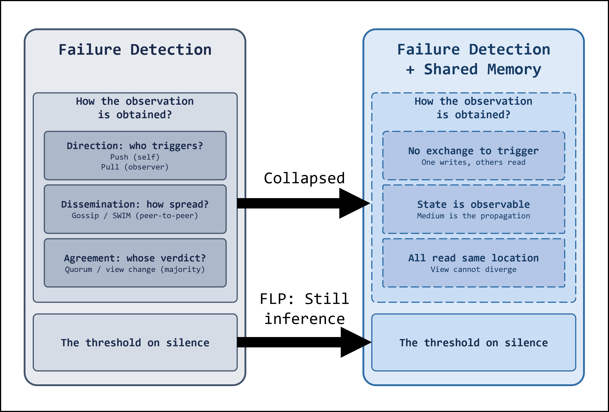

> **Figure 10-1.** Liveness collapse — the twin of Figure 2-2, in two panels. Left,
> message-passing failure detection splits into how the observation is obtained — direction (push
> self / pull observer), dissemination (gossip / SWIM), agreement (quorum / view change) — plus
> the threshold on the silence. Right, under shared memory the observation machinery collapses:
> no exchange to trigger (one writes, others read), state is observable (the medium is the
> propagation), all read the same location (views cannot diverge — at the verdict level, see
> prose); only the silence threshold is still required, and FLP keeps it an inference.

**What CME implemented.** The single surviving knob, at its simplest setting — a static timeout/heartbeat detector: heartbeat publish plus a bounded silence timeout.
Acceptable at CME's peer counts because (given the fencing boundary, [§10.4](#104-recovery-authority)) a false positive costs a spurious recovery cycle and a peer's availability, not safety.

**Procedure.** A peer refreshes its own liveness witness each tick.
The alive check reads the target's *MemberSlot* status.
The failure check reads the target's witness and declares the target dead once the witness has gone unrefreshed for longer than a bounded silence window; a live peer refreshes within that window, so a healthy target never trips it.
How the witness is encoded — a counter the observer watches for stalls, or a timestamp it compares against its own clock — is an implementation detail below this knob.

### 10.4 Recovery authority

*This section owns the RA **decision** — selection, and the claim that makes the selected RA unique.
Everything downstream of a settled claim — takeover, scrub, fencing — is [§7](#7-recovery).*

**The question, and the space of answers.** *Who recovers a dead peer?* The requirement is one RA per dead peer, derivable whenever any peer is alive, and deterministic across peers ([§6.3](#63-policy-requirements)).
Selecting one is really *two* assignments — a dead peer must first be **watched** (someone notices) and then **recovered** (someone acts) — and the two pull in opposite directions:

- **Monitoring assignment** — who watches whom.
  Detection is observation and more watchers detect sooner, so the pressure is to *spread* it:
  - **All-to-all** — everyone watches everyone; O(N²).
  - **Ring / neighbor** — each watches an adjacent peer; O(1) per peer.
  - **Centralized** — one monitor for all; a single point of failure.
  - **Hierarchical** — leaders watch members up a tree.
  - **Gossip / randomized** — watch a random subset and propagate (SWIM [[30]](#references)).

  One constraint cuts across all of them: a monitor can crash too, so it must itself be watched.
The assignments split on how they meet it.
Star and tree carry an **apex** — a distinguished node that watches others but is itself watched by no peer; message passing keeps that viable by making the apex a replicated coordinator, trusted not to die.
The rest — all-to-all, ring, gossip — have no apex: every watcher is a peer like any other, and the regress must close among the peers themselves.
- **Recovery assignment** — who acts.
  Recovery is authority and two recoverers collide, so the pressure is to *narrow* it to one, by one of three principles:
  - **Agreement** — elect or vote a coordinator/view: leader election (Bully, Raft [[16]](#references)), quorum/virtual synchrony [[31]](#references).
  - **Contention** — race for the right; first to grab a lease/lock wins (Chubby-style [[29]](#references)).
  - **Computation** — a deterministic function of membership names it: ring successor, lowest-id, consistent hashing.
    No vote, no race.

They are two mechanisms because the pressures are opposite: monitoring wants many eyes, recovery wants one hand.
Message passing must honor both — anyone may detect, but the right to *act* has to be won, by an election, a lock, or a quorum.

**The collapse, again — under shared memory.** Shared memory collapses each assignment, then the split between them:

- **Monitoring** reduces to a read, and the topology to a ring.
  Watching is a load of the target's slot, not a heartbeat exchange (the signalling and dissemination machinery of [§10.3](#103-liveness-failure-detection) is already gone), so *who* watches whom stops being a scaling problem.
  But with no coordinator ([§3.2](#32-system-model)) there is no trusted apex to absorb the watch-the-watcher regress: any acyclic assignment leaves an unwatched source — a star its center, a tree its root — so a closed cycle is the minimal complete assignment, and with reads free the cheapest one: each peer reads one neighbour, and the cycle covers every watcher.
- **Recovery** reduces to computation.
  A shared membership location makes the RA a deterministic function of what it holds, so both ways of narrowing authority fall away: **agreement** is moot (one authoritative copy, no replicas to reconcile — the §10.3 collapse again), and so is **contention** (nothing to race for when the function already names a unique winner — up to the stale-view residue the claim settles below).
  Only the computed pole survives.
  Read the other way, the design space does not just get pruned by [§6.3](#63-policy-requirements) — it confirms §6.3.
  The requirement came from intuition.
  Yet every coordinated alternative the literature offers — agreement's vote, contention's race — is exactly what §6.3's two rules forbid: a vote is not *deterministic across peers*, and a race is not *derivable whenever any peer is alive*.
  Canvassing the whole design space converges on the requirement rather than breaking it — intuition first, but the design space bears it out.
- **The split itself** dissolves, and onto a **ring**.
  Detection was spread and authority narrowed only because the two carried opposite costs; shared memory zeroes both, so one structure can serve both roles.
  Monitoring already forces the ring (a watched watcher needs a closed cycle).
  Recovery's surviving pole is computed — free to be ring-successor, lowest-id, or a hash — but only *ring-successor reuses the cycle monitoring already laid down*, folding two structures into one; any other choice would keep them apart.
  So the ring is not one option among the computed functions but the single point where both axes meet: *the peer you watch is the peer you recover*.

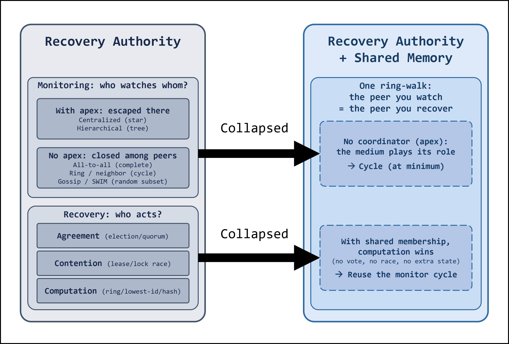

> **Figure 10-2.** Recovery-authority collapse — companion to Figure 10-1, in two panels. Left,
> message passing keeps two separate mechanisms: monitoring (who watches whom? — with an apex the
> regress is escaped there: centralized star, hierarchical tree; with no apex it closes among
> peers: all-to-all complete, ring cycle, gossip random subset) and recovery (who acts? —
> agreement by election/quorum, contention by lease/lock race, computation by
> ring/lowest-id/hash). Right, under shared memory both collapse into one solid structure: no
> coordinator (apex) — the medium plays its role — forces a cycle at minimum; with shared
> membership computation wins (no vote, no race, no extra state) and reuses the monitor cycle;
> one ring-walk — the peer you watch is the peer you recover.

**What CME implemented.** A single ring-walk, doing both roles at once.
Each peer watches its nearest active predecessor, and a dead peer's recoverer is the first alive peer clockwise after it — the same walk names both the monitor and the RA.
Uniqueness follows from the single ring-walk answer, availability from termination at the first alive peer, determinism from every peer walking the same order; direction is immaterial to correctness.
(Selecting the RA is thus trivial.
Keeping it *safe* against a wrongly-declared-dead peer that still writes is the real difficulty — but that is platform enforcement, not selection policy, and lives in [§7.2](#72-the-fencing-boundary)/[§A](#appendix-a--fencing-over-non-coherent-memory).)

**Procedure.** The RA query walks the full ring and returns the first peer the liveness policy reports alive (no one, if solo).
Crashed-but-uncleaned peers still count as active members until recovery frees their slot, so recovery lands nearest-first.

**The claim: arbitrating the recovery right.** Selection alone does not deliver uniqueness.
It is a pure function of membership, so any single consistent view yields exactly one RA ([§6.2](#62-the-policy-contract)) — but membership is only eventually consistent: a reader can observe a stale view over non-coherent memory ([§3.2](#32-system-model)), and while two peers' views disagree, each can derive *itself* as the RA for the same dead peer.
Both would then write that peer's *DomainRecord* at once, breaking uniqueness.

The **claim** closes that window.
Before touching the dead peer's *DomainRecord*, an RA publishes a claim word, written last-writer-wins ([§9.3](#93-last-writer-wins-where-a-single-writer-is-impossible)).
If two peers claim at once, LWW leaves exactly one word standing; the peer whose claim was overwritten reads it back, sees it lost, and stands down.
The transient pair collapses to a single writer before recovery writes anything — so uniqueness holds across the staleness window, not only within one view.
Read against the design space above, the claim is contention's residue: the race that shared membership made moot returns only as a tie-break over the staleness window, one word wide, and is settled by the medium (LWW) rather than by a lock service.

**Why a confirmation is final.** A confirmation is a claim word that survived one settle window — and the gates that keep it that way meet a rival at every stage of its approach:

- **Before it stakes — the selection filter.** A confirmed claim seizes the target's slot to `Recovering` ([§7.1](#71-the-recovery-procedure)), and a seized target drops out of RA selection: a peer that never selects never reaches the word.
  This filter closes at the speed the seize becomes visible ([§3.2](#32-system-model)).
- **At the word — the stake-gate.** A contender stakes over a claim word it has just read fresh (the claim line is never cached, [§9.5](#95-dram-local-state)), and only where the word is free or names a dead RA; a live claim means yield, without writing.
  What this leaves exploitable is only a write still in flight.
- **In flight — the settle.** Contenders whose stakes race each other all re-read after the settle window; one word absorbed every stake, so at most one finds its own value standing, and every other stands down.
- **After everything — the re-read backstop.** The confirmed RA re-reads its claim word on every poll tick for as long as it recovers; a stake that slipped every gate dethrones it within one tick, and the at-most-one-tick overlap writes nothing unguarded — the takeover span already re-seizes records against exactly this kind of staleness ([§7.1](#71-the-recovery-procedure)).

The last stake the gates admit is the final authority.
The settle window's size buys efficiency, not correctness — it sets how often the later gates engage.

The claim is the policy's, not the core's.
Uniqueness is produced by selection *plus* the claim, and splitting the pair would smear one decision across two owners — so the RA policy owns both: the claim word lives in a policy-private FAM region the policy itself sizes and formats (as the successor policies do their demand region, [§10.2](#102-successor-selection-implementation)), and the stake-then-settle arbitration runs inside the policy, spread across poll ticks so a settling peer never stalls its own heartbeat.
The recovery FSM asks one question — *am I the confirmed RA?* — and the takeover/scrub/commit sequence that follows a confirmed answer is [§7](#7-recovery), not here.

## 11. Evaluation

*Numbers from the bench fleet (`tools/`, `run_sweep.sh`); logs and exact configs live with the bench harness.
All FAM numbers on marufs UC mappings unless stated.*

*Methodology ([§2.3](#23-second-reframing-ownership-coordination-framework)): comparisons are within-framework — every policy pays the same ownership, membership, and recovery overheads, so policy numbers are commensurable with each other.
A bare arbitration algorithm benchmarked alone is not; `cme_simple` ([§11.3](#113-policies-compared)) exists precisely to bridge that gap.
The quantitative sections come first; the chapter closes with the qualitative half — how each core requirement is discharged ([§11.6](#116-meeting-the-requirements)).*

### 11.1 Experimental setup

*The development bench; all numbers in this chapter are from it.
One physical host — peers are processes ([§3.1](#31-terminology)), so cross-peer means cross-process over the CXL device.
A cross-host campaign on the target multi-host platform is planned: same harness, new hardware rows.*

| | |
|---|---|
| CPU | 2× AMD EPYC 9555, 64 cores/socket, SMT off, performance governor — 128 cores, 2 NUMA nodes |
| DRAM | 768 GB — 12× 64 GB DDR5-6400 (6 channels/socket) |
| OS | Linux 6.17 (Ubuntu) |
| CXL | XCENA MX1P [[48]](#references) — CXL 3.2, PCIe 6.0 ×8; a 250 GB region exposed as a CPU-less NUMA node, 2 MiB-aligned devdax |
| Governor | `performance` (amd-pstate-epp), boost on |
| FAM mapping | coordination state mapped *uncached* (UC) over devdax ([§9.2](#92-coherency-operations-and-the-wbuc-regimes)) |
| Medium latency | UC whole-line (64 B) load ≈ 243 ns, store ≈ 185 ns ([§9.2](#92-coherency-operations-and-the-wbuc-regimes)) — the anchor for this chapter's numbers |
| Compiler | g++ 13.3, `-O3` (Release), C++17 |
| Peer | one process: one worker + one poll thread ([§9.6](#96-poll-and-worker-threads)) |

### 11.2 Handoff anatomy

*This section opens up a single ownership acquisition: one peer's `lock()`-to-`unlock()` on a domain.
It asks where the time goes.
That breakdown is the lens the policy comparison ([§11.3](#113-policies-compared)) and its scaling grid are read through.
One caveat on reading these spans.
The timing comes from a build with the latency counters compiled in.
That build adds a little overhead of its own.
So the numbers below give the *shape* of an acquire — which phase takes what fraction — not absolute latency.
The headline latencies come from the un-instrumented build ([§11.3](#113-policies-compared)).
The phases are contiguous and account for the whole `lock()`: the outer *Acquire* span brackets it, and the request and grant phases each absorb the setup and cleanup work around them (participation and residency checks, pin/unpin, the between-level tree walk), so the four phases sum to the measured acquire with no residual.*

An acquire divides into four phases, drawn contiguously so they sum to the whole `lock()`:

- **request** — reach the point of asking: entry and residency checks, then signal intent (raise a demand in REQUEST, announce into the tournament in PETERSON).
- **wait** — poll or spin until ownership arrives.
- **grant** — become the holder, and the small cleanup after it (drop the demand, return).
- **release** — the `unlock()` path: unpin, find a successor, and hand the domain on.
  PETERSON also unwinds its tournament tree here.

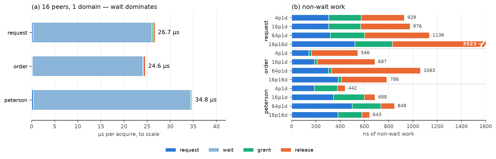

> **Figure 11-1.** Handoff anatomy. (a) One acquire at 16 peers, 1 domain, to scale, for REQUEST,
> ORDER, and PETERSON: the wait phase is >96% of the 25–35 µs, the request/grant/release work a
> thin edge. (b) The non-wait work only, in ns, across four configurations per policy — a
> signature of how each policy hands off: REQUEST spends it in release (a demand scan that grows
> to ~2.7 µs at 16 domains, bar truncated at total 3.5 µs), ORDER has no grant step (token
> rotation) and a fixed handoff whose cost tracks per-domain contention, PETERSON spends it in
> grant (the take-over stamp) with near-zero release.

Figure 11-1(a) draws one acquire to scale at moderate contention (16 peers on one domain).
The wait swallows the bar.
The other phases are the work CME actually executes, and together they are a thin strip at the end: wait is more than 96% of acquire latency for all three policies in this configuration.
This is the first finding, and it holds in every configuration measured: **the measured latency is dominated by time spent awaiting ownership rather than by the local work that publishes a request, completes a grant, or releases the domain.**

Figure 11-1(b) isolates the non-wait work, magnified to nanoseconds.
It is small — a few hundred nanoseconds against tens of microseconds of wait — so it moves no total.
But it is not uniform.
Its shape is a signature of how each policy answers one question: who acquires next?

- **REQUEST — the releaser finds a taker.** On release, the peer walks the ring and reads each peer's demand line to find one that asked for this domain.
  Its work concentrates in release, and that release grows with domains.
  With one domain every peer wants it, so the scan stops at the first read.
  With sixteen, demand for any single domain thins out, so the scan walks most of the ring before it finds a taker or gives up (~2.7 µs at 16 domains).
  Its grant is one FAM write — the peer drops its own demand — flat across peers and domains.
- **ORDER — the token rotates.** There is no become-holder step (grant is near zero): when the token arrives, the peer is already the owner.
  The releaser hands the domain to the next participant on the ring, asked or not — a successor fixed by ring position, not searched for.
  So the release is just the fixed handoff: read the record, write the new holder.
  Its size tracks per-domain contention on those lines, not a scan.
  ORDER's real scaling cost is not here but in the wait, where a peer waits O(N) for the token to come around ([§11.3](#113-policies-compared)).
- **PETERSON — the winner self-selects.** There is no successor search.
  On release the peer just vacates the record and unwinds its tree; the next contender climbs to claim it, so release is near zero.
  Its work is the tournament itself: the per-level announce (request) and the take-over stamp (grant).
  The grant is one FAM write — the winner stamps the record to claim it — flat like REQUEST's.
  The request side grows O(log N) with the peer count, as the tree deepens.

So the same non-wait budget lands in three different phases: REQUEST in release, ORDER in the wait, PETERSON in grant.
The difference is how each answers *who acquires next*.
REQUEST searches the demand lines — an O(domains) cost, because demand for one domain thins out as domains multiply, and it is paid in *work* on the releasing peer.
ORDER needs no search: the next participant is fixed by ring position.
PETERSON needs no search either: contenders self-select by climbing.
This placement is the structural difference the policy comparison ([§11.3](#113-policies-compared)) turns into a recommendation.

So the wait is the cost.
And the wait is not one thing:

- **Contention** — the unavoidable part.
  With *N* peers on one domain, a waiter sits behind up to *N*−1 handoffs.
  This is why the wait in Figure 11-1(a) grows from ~4 µs at 4 peers to ~120 µs at 64 ([§11.3](#113-policies-compared) follows the growth).
  No protocol removes it.
  Spreading the load over more domains does: 16 peers over 16 domains drops PETERSON's acquire back to ~5 µs.
- **Medium** — each poll or tournament read is a UC access (~240 ns, [§9.2](#92-coherency-operations-and-the-wbuc-regimes)).
  The per-step cost is set by the fabric, not the algorithm.
  PETERSON's spin-heavy climb pays this on every level.
  That is why it runs slightly longer than REQUEST at equal contention.
- **Poll granularity** — the *uncontended* limit, where no one is waiting to be handed the domain.
  A migrate takes ~50 µs.
  Of that, ~46 µs is the successor *waiting to be noticed*: the releaser has published the handoff, but the successor only polls every interval.
  This is tunable (poll cadence), not a protocol path length.
  Under contention it vanishes, because the next owner is already spinning.
  Pipelining overlaps the next decision with the current critical section.
  So sequential hand-to-hand is paradoxically the *worst* case for migrate latency, not the best.

The polling cost has a floor, and the medium sets it, not the protocol.
A UC poll read is ~335 ns uncontended; under concurrent write-read it runs 370–470 ns — a 40–140 ns penalty — plus a tail.
It worsens as more peers poll the same line.
This is the read-storm that motivates shadow records ([§9.4](#94-shadow-domain-records-distribution-without-a-second-truth)).

### 11.3 Policies compared

*The handoff anatomy ([§11.2](#112-handoff-anatomy)) showed the non-wait work landing in a different phase for each policy.
This section runs all four over the (peers × domains) grid to ask where each one is cheap and where it is not.*

The workload is a contention sweep.
Each peer runs one worker thread that repeatedly locks and unlocks domains with no hold time; in each pass it visits every domain once in a freshly shuffled random order, so all peers issue the same number of acquires per domain but their phases are decorrelated.
A run fixes one (peers, domains) point; the reported latency is the per-acquire `lock()`-to-owned time, averaged over repeated runs.
The RDMA-CAS baseline uses the same shuffled per-peer access pattern.

Four policies run the same grid on the headline build: PETERSON, REQUEST, its aggregating variant REQUEST-AGG, and ORDER.
Figure 11-2 plots mean acquire latency against peer count, one facet per domain count, with our own RDMA-CAS remote-lock measurement as an off-substrate baseline.
Figure 11-3 shows the full grid, mean above and p99 below.

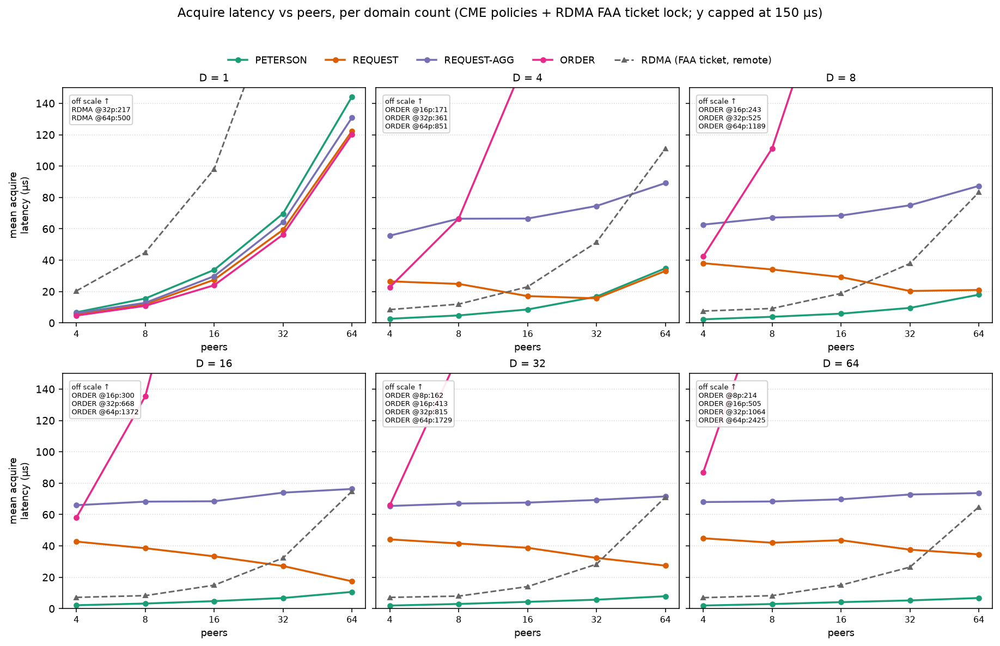

> **Figure 11-2.** Policies compared: mean acquire latency vs peers, one facet per domain count,
> for the four CME policies and the dashed RDMA FAA ticket lock (two-node ConnectX-5 RoCEv2,
> different hardware, same shuffled workload). y capped at 150 µs; points above the cap are
> listed per facet. On one hot domain (D=1) the four track within a fifth of each other and all
> run below the remote lock; spreading the load over domains pulls them apart — PETERSON
> improves, REQUEST and REQUEST-AGG rise, ORDER collapses — and only PETERSON stays under the
> dashed line in every facet.

**Each policy pays in a different place.** On one hot domain (D=1) the four track within a fifth of each other — 5–7 µs at 4 peers, 120–145 µs at 64 — and all sit 3.4–4.2× below the remote ticket lock (below).
Spreading the load over domains separates them by mechanism.
PETERSON is contention-bound: 144 µs at 64 peers on one domain, 6.8 µs once those peers spread over 64 domains — spreading removes the contention that was its whole cost.
REQUEST and REQUEST-AGG run the other way: cheap on the hot domain (5–6 µs at 4 peers) but rising as domains spread (REQUEST 45 µs at 4 peers × 64 domains), because with demand scattered across domains an unlock rarely finds a waiting requester, so the handoff is deferred to the releaser's poll cycle and paced by it ([§11.2](#112-handoff-anatomy)).
ORDER is fastest on the hot domain — 4.7 µs at 4 peers, a clean O(N) rise to 120 µs at 64, since the token holder is already the owner — but collapses as domains spread: 87 µs at 4 × 64 and a 2.4 ms mean at 64 × 64.
Alone among the four it does not get cheaper as domains spread, and its waits there run into the sleep path (next).

**The sleep path is that collapse.** When a wait outlasts the spin-before-sleep window the peer sleeps, and the sleep-and-wake overhead accumulates on top of the wait.
That is what ORDER pays once domains spread — its waits there run past the window — while PETERSON and REQUEST, whose waits mostly fit inside it in this range, stay on the spin path and avoid the cost.
The bench makes that cost worse at the top of the grid: at 64 peers it runs 128 threads — one worker and one poll thread per peer ([§9.6](#96-poll-and-worker-threads)) — on 128 cores, so there is no spare core to absorb a wake and every sleep pays a context switch on a saturated machine.
Two design consequences: high peer counts want a wait bounded by O(log N) rather than O(N), and poll threads must not be core-resident at that scale (thread model, [§14](#14-conclusion)).

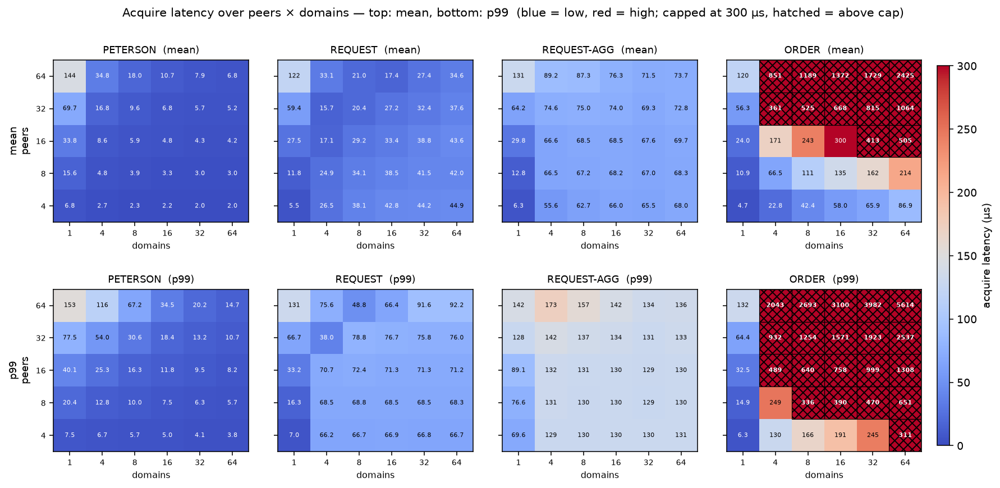

> **Figure 11-3.** Acquire latency over the full peers × domains grid, mean (top row) and p99
> (bottom), per policy. Blue is low, red high; capped at 300 µs, cells above the cap hatched.
> PETERSON's cost concentrates on the hot-domain column (contention); REQUEST and REQUEST-AGG
> rise across the many-domain columns (handoff deferred to the poll cycle); ORDER is fast only
> on the hot-domain column and collapses wherever domains spread — the sleep path, slow at the
> median, not merely a tail.

**Tail behaviour splits the policies** (Figure 11-3, bottom row).
PETERSON's tail is tight — p99 within ~10% of the mean everywhere — because the climb neither sleeps nor searches.
REQUEST and REQUEST-AGG carry a moderate tail once domains spread (p99 roughly 2–3× the mean), REQUEST-AGG the heavier of the two.
ORDER's spread cells are not a tail effect: at 64 × 64 its p50 (2.4 ms) already sits at the mean — the sleep path catches nearly every acquire, not a minority.

**Why a remote lock is the bar.** RDMA distributed locking is the deployed answer to the same problem shape — mutual exclusion over memory that is shared but not locally coherent ([§12.2](#122-rdma-distributed-locking)).
It is also the case where a cross-host atomic exists: the NIC executes the CAS or fetch-add, so a lock manager selects a winner the way a local one does.
Measuring against it asks what a remote hardware atomic buys.
The family is a developed line rather than one design — FaRM [[35]](#references), DSLR [[36]](#references), Sherman [[37]](#references) and Citron [[38]](#references) all arbitrate this way, and the disaggregated-memory work (DecLock [[41]](#references), Lotus [[42]](#references)) continues it on the same primitive.
Those are research systems, but the primitive under them is shipped hardware: NIC-executed CAS and fetch-add are IB verbs standard and present on the commodity RoCE part we measured on.
That is what makes this a practical alternative rather than a thought experiment.

**Which acquire policy is the fair opponent.** Our harness implements three over the same lock word: blind re-CAS, exponential backoff, and a DSLR-style FAA ticket lock (ordering core only, [§12.2](#122-rdma-distributed-locking)).
Blind is the documented O(N²) lock-storm — 3.0 ms at 64 peers on one domain — and no lock manager ships it, so it is the family's worst case rather than its practice.
The ticket lock is FCFS and bounded, which is what the cited systems do, so it is the number to beat.

| 64 peers | CME (PETERSON) | RDMA FAA ticket | ratio |
|---|---|---|---|
| 1 domain | 144 µs | 500 µs | 3.5× |
| 8 domains | 18 µs | 83 µs | 4.6× |
| 64 domains | 6.8 µs | 65 µs | 9.5× |

**Against the ticket lock, only the climb wins everywhere.** PETERSON is below the remote lock in all 30 cells of the grid, and it climbs at nearly the same rate — exponent 1.10 against 1.15 in peers — so the separation is a constant factor rather than divergence.
The other three lose ground once domains spread: REQUEST is slower than the remote lock in 16 of the 30 cells, REQUEST-AGG in 24, ORDER in 25.
The cause is the deferral above — with demand scattered, an unlock rarely finds a waiting requester and the handoff waits for the releaser's poll cycle, which costs more than a NIC round trip.
A poll-paced handoff is the thing a remote lock beats; a climb is not.

The floor is where the substrate shows: one NIC round trip is ~3.1 µs uncontended and the ticket lock pays two of them per acquire (FAA, then the `serving` read), against CME's bus-local stores.
That part of the gap is the interconnect rather than the protocol.

### 11.4 The LWW settle window

*Two paths cannot pre-assign a writer and so arbitrate by last-writer-wins over a single UC word ([§9.3](#93-last-writer-wins-where-a-single-writer-is-impossible)): cold-join admission and the recovery claim ([§10.4](#104-recovery-authority)).
Both run the same shape — a staker writes its nonce, waits a fixed settle interval, then re-reads and holds the lease only if its nonce survived.
The settle must outlast the window in which a later staker can still overwrite, so that window sets the constant.
This section measures it.*

We measured the window directly: N stakers race one line from a common start, each stamping its own read and its own stake.
Nothing else touches the line during a round, so the spread is staker traffic alone.
The last stake is the moment the winner is fixed, so the span from the first stake to it is what a fixed settle must cover.

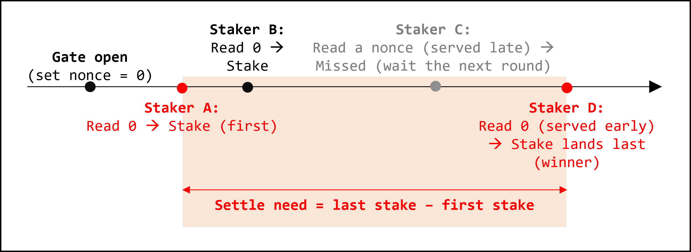

> **Figure 11-4.** One claim round, drawn logically — no time scale. A DRAM gate opens the
> round with the word already at zero, so nothing polls the UC line while the stakes race. Each
> staker reads the word and stakes only if that read returned zero; a staker whose read is
> served later finds another's nonce there, misses the round (grey), and waits without
> re-staking. Reads and stakes are served at different times under the concurrent traffic, so a
> staker that read zero early can still land its stake last — and the last stake wins. The
> window a staker must outlast runs from the first stake to the last one; red marks those two.

On the UC line, one staker per core, over the rounds where two or more stakers actually raced (2000 rounds per point):

| N (peers racing one cacheline) | 1 | 2 | 4 | 8 | 16 | 32 | 64 |
|---|---:|---:|---:|---:|---:|---:|---:|
| settle p50 (µs) | — | 0.6 | 1.2 | 2.5 | 2.6 | 4.9 | 9.6 |
| settle p99 (µs) | — | 5.6 | 3.2 | 134 | 3.0 | 5.4 | 125 |
| worst observed (µs) | — | 28 | 7.8 | 256 | 214 | 86 | 524 |

With a single staker there is no race and nothing to settle.
From two upward the median grows with the peer count — ~1 µs at 4, ~2.5 µs at 8 and 16, ~9.6 µs at 64.
It is not two stores queueing: a UC store is ~185 ns, and only one or two of the N ever stake at all — the rest read a nonce, miss the round, and do not re-contend.
A peer stakes only on a read that returned zero, so a late stake is a peer whose read was served after another peer's store and still came back free.
We measured that lag directly, and it lands on the settle span at every peer count (9.7 µs against 9.8 µs at 64, 5.0 against 5.1 at 32).
**What the settle covers is how long a store stays invisible to another peer's read of the same line** — and it grows with the number of peers reading it, because every read joins the same queue at the device.

The settle is a safety bound, not a latency target.
A staker that re-reads before the last stake finds its own nonce standing and declares a win that a later store then overwrites — two peers holding one lease.
What it must clear is therefore the worst case, not the 99th percentile.
Neither tail statistic is stable here.
A staker preempted between its read and its store lands anywhere above the median, which is why the p99 row is not monotone in N and the worst observation moves from run to run: it is kernel preemption and IRQ work on cores we do not isolate, not line contention.
No finite settle is a proof against an arbitrarily long preemption either — that a staker is not descheduled for longer than the settle is an assumption the design names rather than measures.
So the constant is sized off the worst observation with room above it — 5 ms against a worst of ~1 ms — which costs nothing on a path taken only on a cold join or a crash.

### 11.5 Recovery latency

Recovery is detection, then the claim ([§10.4](#104-recovery-authority)) and the procedure it authorises ([§7.1](#71-the-recovery-procedure)).
Detection is a fixed liveness timeout — policy-independent and set by design — so we exclude it and measure that procedure in full, from the RA's claim through to the slot commit, timed from the recovery trace (first claim tick to slot release).
Figure 11-5 sweeps it over the (peers × domains) grid, one facet per policy, on the UC line.

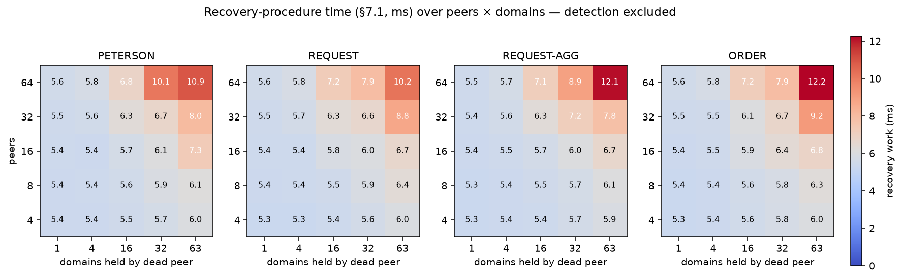

> **Figure 11-5.** The [§7.1](#71-the-recovery-procedure) recovery procedure, timed from the CME
> trace, over peers × domains, one facet per policy, detection excluded. It grows with both axes:
> every surviving peer and every held domain the procedure must sweep, from ~5.3 ms at 4 peers ×
> 1 domain to ~10–12 ms at 64 × 63. Even the corner stays far below the detection window.

The procedure grows along **both** axes — it sweeps every held domain and every live participant — roughly O(peers × domains), above a ~5.3 ms floor.
That floor is not work: it is the settle the claim waits out ([§11.4](#114-the-lww-settle-window)), a constant we chose.
The sweep itself adds nothing measurable at one domain and up to ~7 ms at the 64 × 63 corner, where the total reaches 10–12 ms. Even so this is a small fraction of the detection window: **recovery latency is detection-bound.
The work after detection scales with the crashed peer's footprint, but never approaches the fixed detection cost, and the policy barely moves it.**

### 11.6 Meeting the requirements

*The qualitative half of the evaluation, closing the chapter.* Each core requirement ([§3.3](#33-core-requirements)) holds because every way it could break is closed — by construction, by a model-checked invariant, by a policy contract, or by a platform assumption the design names explicitly.
The table names each closure, where it is established, and which layer ([§5.1](#51-layering)) carries it: the core machine, a policy, the peer runtime, or the platform.
What analysis cannot settle — the conditional-liveness half and the costs — is what the numbers above measured.

| Requirement | How it could fail | What closes it | Layer |
|---|---|---|---|
| *R1 — exclusive ownership* | two peers write a record at once | at most one owner by construction (single-valued record, [§4.1](#41-the-domainrecord-and-the-memberslot))<br> only the holder — or its RA — writes it, by the transfer discipline ([§4.2](#42-peer-roles)) | core |
| | a peer seizes a record naming no one on its own | either release never vacates,<br>or the vacant record is writable only by the policy's arbitration ([§4.5](#45-events), [§10.2](#102-successor-selection-implementation)) — never by an observer ([§6.3](#63-policy-requirements)) | core + policy |
| | the old owner's own threads keep writing after handoff | a pinned domain is never transferred; release drops the pin last — the worker/poll barrier ([§9.6](#96-poll-and-worker-threads), [§10.2](#102-successor-selection-implementation)); the transfer publication is the old owner's final write to the domain | runtime |
| | a waiter adopts the shadow as authority — or the owner crashes between shadow and truth | the shadow is a hint; the adopt path re-reads the truth line, which alone decides; shadow-first, truth-last publication makes the failure direction harmless ([§9.4](#94-shadow-domain-records-distribution-without-a-second-truth)) | runtime |
| | a falsely-declared-dead owner and its RA write at once | the platform fences the declared-dead peer before destructive recovery ([§7.2](#72-the-fencing-boundary), [§A](#appendix-a--fencing-over-non-coherent-memory)) — crash-stop is enforced, not assumed | platform |
| *R2 — ownership continuity* | a crash leaves the domain ownerless | by construction — a crashed owner remains the owner until recovery moves it ([§4.7](#47-invariants)) | core |
| | ownership drifts to a peer the policy never chose | by construction — only the record's owner moves the record ([§4.7](#47-invariants)) | core |
| | recovery forks: stale views nominate several RA candidates, or none | the RA policy contract — exactly one RA per peer ([§6.3](#63-policy-requirements)); stale views may *nominate* many, but the claim admits exactly one *executor* ([§10.4](#104-recovery-authority)) | policy |
| *R3 — ownership progress* | a dead peer's domains never reach a live peer | *I1* keeps the dead holder pending ([§8.3](#83-invariants)); *I2* eventually completes recovery under fairness ([§8.4](#84-abstractions-and-limits)); latency measured end-to-end ([§11.5](#115-recovery-latency)) | core |
| | stale policy-private state blocks progress after recovery | the per-policy recovery hook scrubs the dead peer's private state before the slot frees ([§6.3](#63-policy-requirements), [§7.1](#71-the-recovery-procedure)) | policy |
| | a live requester waits forever | delegated to policy liveness ([§6.2](#62-the-policy-contract)) plus scheduling fairness ([§8.4](#84-abstractions-and-limits)); per-policy behavior under contention measured in [§11.3](#113-policies-compared) | policy |
| | published writes stay invisible; churn never quiets; no live peer survives | named assumptions, not mechanisms: bounded staleness ([§3.2](#32-system-model)), publication and visibility ([§9.2](#92-coherency-operations-and-the-wbuc-regimes)), at least one live peer and eventual quiescence ([§3.3](#33-core-requirements), [§8.4](#84-abstractions-and-limits)) | platform |
| *R2 + R3* | a stale peer grants a domain to the dead target mid-recovery — or the chosen successor has just crashed | participation is cleared first; the takeover scan outlasts the staleness window and re-seizes late-dirtied domains ([§7.1](#71-the-recovery-procedure)); a since-crashed successor still names the record, so it is ordinary dead-holder recovery | core |
| | the RA crashes mid-recovery | every step before the commit is idempotent; the slot-free commit is written last; a successor RA re-runs from the top — *I2* holds for *any* live peer ([§7.1](#71-the-recovery-procedure), [§8.3](#83-invariants)) | core |
| | a slot is reused before recovery completes — or a leaver strands its domains | dead space returns only through `Recovering`; the slot-free commit is the readmission gate ([§4.4](#44-member-states), [§7.1](#71-the-recovery-procedure)); a leaver hands off unconditionally before freeing its slot ([§3.3](#33-core-requirements)) | core |

---

## 12. Related Work

*[§1.2](#12-why-existing-approaches-dont-fit-every-answer-assumes-a-different-environment) dismisses these families in a paragraph each; this chapter records CME's place among them properly.*

The lens throughout is what a non-coherent, multi-host memory changes for each family: the coordination gap it opens, the machinery it dissolves, or the assumptions it breaks.
The chapter runs from the closest neighbours to the oldest ancestors.
The CXL-era systems ([§12.1](#121-cxl-era-systems)) share CME's medium and open the coordination gap it fills; RDMA distributed locking ([§12.2](#122-rdma-distributed-locking)) is the nearest prior generation of remote-memory coordination.
The classical families follow: distributed lock managers ([§12.3](#123-distributed-lock-managers)) and message-passing mutual exclusion ([§12.5](#125-message-passing-distributed-mutual-exclusion)), whose coordination machinery *dissolves* once state is directly readable; software DSM ([§12.4](#124-software-distributed-shared-memory)), the mirror-image problem of emulating the coherence CME simply omits; load/store-only mutual exclusion ([§12.6](#126-loadstore-only-mutual-exclusion)), whose atomics-free proofs CME redeploys once it supplies the coherence they assumed; and recoverable mutual exclusion ([§12.7](#127-recoverable-mutual-exclusion)), the closest academic line, which shares CME's crash-as-first-class stance but on a single coherent machine.

### 12.1 CXL-era systems

**Why software must coordinate.** Most published CXL work targets capacity — memory pooling, expansion, and disaggregation economics ([[1]](#references) surveys the space).
Coordination is the open problem beside it, and the hardware hands it to software.
CXL 3.0 back-invalidation coherence tracks a per-device directory and snoop filter across hosts, so fabric-wide hardware coherence scales only for read-mostly sharing ([[1]](#references), [§3.2](#32-system-model)).
Aguilera et al. name this the "coherence conundrum" of disaggregation and argue for federated, software-mediated coherence over fabric-wide hardware coherence [[20]](#references).
CME is a concrete inhabitant of that position: it arbitrates writes to shared FAM in software, assuming no hardware coherence at all.

**What the CXL landscape builds.** The systems now shipping on CXL sharing exploit it for data movement and capacity; where they coordinate, it is between one writer and one reader, not among contending writers. cMPI turns inter-node MPI — one-sided and two-sided — into transactions and copies inside shared CXL memory, replacing the network path and cutting small-message latency by 7–8× over TCP interconnects [[34]](#references).
Its synchronization is a single-producer/single-consumer handshake — Post-Wait and Start-Complete toggle flags, one writer per line by construction — so it needs no atomics and no arbitration; that is the contention its queue structure is built to avoid.
TraCT shares an LLM KV cache across a rack over non-coherent FAM [[19]](#references).
Measurement work runs an n-thread Peterson lock on real CXL hardware and confirms the cost structure our microbenchmarks ([§9.2](#92-coherency-operations-and-the-wbuc-regimes)) found independently: load/store works, cross-host atomics do not, and software must supply the ordering [[18]](#references).

**The gap.** These move data or share capacity, and where they coordinate they keep one writer per line to avoid the problem.
CME takes on exactly what that structure sidesteps: multiple hosts writing the same lines, plus recovery of a dead writer's ownership.
That coordination niche — mutual exclusion plus dead-holder recovery over non-coherent FAM — is what this report documents.

### 12.2 RDMA distributed locking

The immediate prior generation of remote-memory coordination: distributed locks over RDMA, where a client reaches remote memory through a NIC rather than a coherent load/store bus.
This is CME's nearest neighbor in problem shape — mutual exclusion over memory that is shared but not locally coherent.
CME inherits the ambition of the decentralized branch: arbitrate shared memory with no coordinator on the common path.
DSLR [[36]](#references) is the closest in spirit — it adapts Lamport's bakery to RDMA with no queues and no coordinator messages, exactly CME's server-less, fairness-first instinct.

Two assumptions break.
First, the **arbitration primitive**: almost every high-performance RDMA lock (FaRM [[35]](#references), DSLR [[36]](#references), Sherman [[37]](#references), Citron [[38]](#references)) leans on NIC atomics — CAS or fetch-add on the lock word — to install or steal ownership safely.
CME has no atomics of any kind; a store is the only primitive, so ownership transfers by single-writer discipline, not read-modify-write.
Second, the **latency model**: a one-sided RDMA operation still crosses the NIC and costs a network round trip (~µs); "one-sided" is CPU-bypass, not bus-local.
CME's uncontended path is a handful of local CXL loads in the tens-to-hundreds-of-nanosecond class over a real memory bus.

**Recovery** is the sharpest divergence, because a crashed lock holder is first-class for CME and only sometimes for this family:

| System | Who reclaims a crashed holder | Mechanism | Distance from CME |
|---|---|---|---|
| FaRM [[35]](#references) | external cluster manager | lease + reconfiguration + replication | far — coordinator-driven, not a survivor peer |
| Patronus [[39]](#references) | the memory node | heartbeat/lease timeout re-grants the permission | near in model (holder crash is first-class) — but memory-side, atomics, and a lease-timing race |
| FUSEE [[40]](#references) | surviving clients | replay an embedded operation log | near in stance (survivors act) — but recovers data/metadata, not lock ownership, via log + CAS |
| DecLock [[41]](#references), Lotus [[42]](#references) | surviving compute nodes | crash-stop holder-loss recovery; ownership transfers among compute nodes, waiters queued atomically on the memory node | nearest on the failure model (crash-stop + peer-driven recovery) — but RDMA atomics, and lock state centralized on the memory node |
| RME ([§12.7](#127-recoverable-mutual-exclusion)) | the crashed process itself | resurrect and run a recovery section | self-recovery, on coherent memory |

No RDMA lock combines CME's four choices: plain-store arbitration (no CAS/FAA), a non-coherent medium, crash-stop with no holder resurrection, and a surviving peer that reclaims the dead holder's ownership through an authority baked into the lock protocol.
Patronus makes holder crash first-class but reclaims from the memory side with atomics and a wall-clock lease — inheriting the **false-release race** (a lease can expire while a delayed write from the presumed-dead holder is still in flight) that CME's crash-stop-plus-RA design avoids by construction.
FUSEE lets survivors drive recovery, but for data consistency, not ownership.
The recent disaggregated-lock work reaches the recovery axis most directly: DecLock [[41]](#references) and Lotus [[42]](#references) both tolerate a crashed holder and rebuild lock state without it, and DecLock transfers ownership among compute nodes rather than through a central master — the failure-model half of CME's point.
But both keep arbitration on RDMA atomics and the lock's state on the memory node, so they miss the atomics-free, passive-medium half.
The point CME occupies — atomics-free, coherence-free, survivor-recovered mutual exclusion with recovery fused into the lock — is, to our knowledge, unoccupied.

### 12.3 Distributed lock managers

Distributed lock managers coordinate access to named resources through a lock service: the VMS DLM [[3]](#references), the cluster-filesystem DLMs of GFS2 and OCFS2, and coarse-grained lock services such as Chubby [[4]](#references).
Across the family the authority is a place a client sends messages to — a lock server, a per-resource master node, or a Paxos quorum (Chubby).
A DLM exists because cluster nodes share no memory to hold the lock state; the messaged authority (or, in shared-disk variants, a shared-storage lease reached by I/O) is a consequence of that absence, not a design preference.
CXL FAM removes the absence, and with it the assumption.
When the authority is the shared region instead of a node, three things change:

- **No round trip to ask.** A DLM client sends a lock request to the manager and waits for the grant; the exchange has a network RTT floor, and the manager serializes the requests it fields.
  On FAM the lock state is a value in the shared region — a peer reads it with a load and stakes its claim with a store, in nanoseconds, with no service in the path ([§5.3](#53-domain-types)).
- **The truth is read, not decided.** A DLM grant is a decision the manager computes and returns, and the client trusts the reply.
  On FAM every peer reads the same authoritative line directly: there is no decision to relay, and no coordinator whose failure stalls the grant.
  The medium is the authority.
- **No central bottleneck.** A DLM master for a resource is a single serialization point and a scaling limit; the shared region places each domain on its own line ([§9.4](#94-shadow-domain-records-distribution-without-a-second-truth)), so independent domains never queue behind one manager.

Recovery shifts the same way.
A DLM reclaims a dead holder's locks through the manager or a failover master; CME gives that job to a surviving peer, which reads the shared state and takes over the dead holder's domains directly ([§7](#7-recovery)) — the coordination layer still owns recovery, but no lock service sits in the path.

### 12.4 Software distributed shared memory

Software DSM emulates coherent shared memory over a message-passing cluster: Ivy [[5]](#references) with page-granularity invalidation, TreadMarks [[6]](#references) with relaxed consistency models that amortize the invalidation traffic.
A DSM exists because the cluster has message passing but no shared memory; it manufactures in software the shared memory the hardware lacks.
CME is the mirror image — the shared memory is real, and what is missing is not coherence but arbitration.
CXL provides the memory DSM had to fake, and that inversion changes what the mechanism is for:

- **Nothing to emulate.** DSM spends its machinery manufacturing single-copy semantics over the network: page invalidation, page ownership, consistency protocols.
  FAM already is a single physical copy every peer addresses, so CME emulates no coherence at all — it assigns explicit ownership of each domain instead ([§5.3](#53-domain-types)).
- **The cost that pushed DSM to lazy is the cost that caps hardware coherence.** DSM moved from eager to lazy consistency because invalidation traffic scales with write-sharing; that same economics qualifies CXL 3.0 back-invalidation coherence to read-mostly sharing ([[1]](#references), [§3.2](#32-system-model)).
  What DSM built in software and CXL 3.0 rebuilds in hardware, CME declines to build — it treats the memory as non-coherent and coordinates ownership explicitly, so no coherence traffic scales with anything.

### 12.5 Message-passing distributed mutual exclusion

Classical distributed mutual exclusion coordinates access by passing messages between the processes themselves, with no lock manager: permission-based algorithms grant on request (Ricart–Agrawala [[7]](#references)), token-based ones circulate a single permission (Raymond's tree [[8]](#references); token rings).
The breaking assumptions are reliable processes, reliable channels, and static membership: classical DME has no way to handle a crashed token holder — the token vanishes with the dead node and the system deadlocks, so the failure is left to something outside the protocol.
For CME a dead owner is an ordinary state the protocol handles itself ([§4.7](#47-invariants)), and membership churn is part of the workload ([§3.2](#32-system-model)).
The latency model also inverts: message complexity (the classical metric) is nearly irrelevant when a "message" is a 64-byte store; what matters is polling geometry and handoff count ([§9.4](#94-shadow-domain-records-distribution-without-a-second-truth), [§11.3](#113-handoff-anatomy)).

The deeper relationship is the **discovery collapse** ([§2.1](#21-initial-approach-distributed-mutual-exclusion-with-shared-memory)): every family spends its complexity on the same question — *who decides ownership right now?* — by a different route, whether locating a token, establishing it from grants, or intersecting quorums.
That complexity exists only because ownership is unobservable at a distance: with no shared state, a peer cannot see who holds the right and must infer it by exchanging messages.
Shared memory removes the unobservability — ownership is a value at a known address, read in one load — so the inference, and every mechanism built to carry it out, has nothing left to do.
Worked family by family against Singhal's taxonomy [[15]](#references):

| Family | Representatives | Discovery mechanism | Why — once the record is loadable |
|---|---|---|---|
| Token + tree | Raymond [[8]](#references), Naimi–Trehel [[13]](#references) | direction hints along a path | the hints encoded where the token was; the record stores that location explicitly, so the path has nothing left to resolve |
| Token + ring | Le Lann lineage | none — the token finds you | ring rotation never inferred ownership — it is a next-owner order, not discovery — so nothing collapses; it survives as ORDER |
| Permission / broadcast | Ricart–Agrawala [[7]](#references), Suzuki–Kasami [[12]](#references) | ask every node | the broadcast only polled peers for state that now sits in one readable record; with no one left to ask, a bare request/grant remains (REQUEST's shape) |
| Quorum | Maekawa [[14]](#references) | intersecting subsets expose conflicts | the intersection existed to make two conflicting requests meet without shared state; the record exposes the conflict directly, so no intersecting set is needed |
| Consensus lock | Raft [[16]](#references) | leader owns replicated state | replication existed to agree one copy across nodes that share nothing; the shared record already is that copy, leaving only serialized access — mutual exclusion itself |

What survives the collapse is a single decision — *who's next?* — and that is why CME's policy boundary has exactly that shape ([§6.1](#61-why-a-policy-abstraction)).

### 12.6 Load/store-only mutual exclusion

Load/store-only mutual exclusion proves that mutual exclusion needs no atomic read-modify-write — plain reads and writes suffice: Lamport's bakery [[9]](#references), Peterson's algorithm and its tournament generalization [[10]](#references).
The proofs, though, always assume *coherent* memory: a store reaches every other reader with single-copy, whole-word semantics, and program order supplies the happens-before the argument needs.
CME redeploys these algorithms directly — Peterson is one of its successor policies ([§11.3](#113-policies-compared)) — but on a non-coherent fabric, where each of those free guarantees becomes protocol work:

- **Visibility is not automatic.** On coherent memory a store reaches other readers on its own; on FAM a write stays invisible until CME publishes it (a flush and fence, or a UC mapping).
  The turn flags and choosing bits the algorithm spins on are correct only once CME makes each write observable to the peers watching it ([§3.2](#32-system-model)).
- **A read is not guaranteed whole or current.** The proof assumes a read returns the latest single copy of a word; on FAM a line can be stale or torn.
  CME recovers single-copy semantics by keeping one writer per line and reading whole, aligned lines.
- **Ordering is not implicit.** Bakery and Peterson lean on program-order visibility; a non-coherent fabric reorders freely, so CME inserts fences to re-establish the happens-before edges the proof requires.

Supplied with those, the textbook algorithm is not merely correct on this medium but the latency champion of the policy family ([§11.3](#113-policies-compared)): Peterson's tournament climb *is* the notification, so there is no separate wake-up, and its cost grows as O(log N) rather than with contention.

### 12.7 Recoverable mutual exclusion

The closest academic line: Golab & Ramaraju formalized RME [[11]](#references), where processes may crash *and recover* while acquiring, holding, or releasing a lock, with complexity measured in remote memory references — motivated by non-volatile main memory.
The shared insight is exactly ours: a crash inside the protocol is first-class state, not an error.
The models then diverge on every axis that shapes CME:

| | RME | CME |
|---|---|---|
| Setting | one shared-memory multiprocessor — processes/threads on a single machine | many hosts over a disaggregated fabric ([§3.2](#32-system-model)) |
| Failure model | crash-*recover*: the same process restarts and re-enters the protocol | crash-*stop*: a dead peer never has to return |
| Who recovers | the crashed process itself, from durable local state | *surviving* peers, via Recovery Authority ([§7](#7-recovery)) |
| Primitives | coherent shared memory, RW/atomic registers | non-coherent shared memory, plain loads/stores only |
| Membership | static process set | dynamic join/leave/churn ([§3.2](#32-system-model)) |

Taken to CXL, RME's own assumptions give way on two axes.
Its algorithms assume coherent memory — visibility, whole-read, and ordering — which a non-coherent fabric withholds.
More fundamentally, RME recovery presumes the crashed process returns to run its recovery section from durable local state; under crash-stop, on a fabric where a dead host may never rejoin, there is no process to resurrect, so self-recovery has no actor.
CME's survivor-driven Recovery Authority is that missing actor — and the choice between the two loci is structural: RME localizes recovery inside the crashed process, so it needs no failure detection, no membership, no epochs; CME hands recovery to surviving peers, which is precisely why those three subsystems are core here ([§5](#5-architecture)) and absent there.

---

## 13. Lessons Learned

*Written for others building coordination over non-coherent shared memory — the design rules that transferred, not a log of what broke.*

1. **When the substrate changes, re-derive rather than port — and expect the old machinery to collapse.** Each prior family solves a problem shaped by its environment; abstract it to the problem it actually solves — *where does ownership live right now?*, *who coordinates recovery?* — then re-derive under the new substrate instead of carrying the old protocol over.
   Done across a whole design, this repeatedly turned distinct prior mechanisms into the same small residue.
   Discovery — token location, permission broadcast, quorum intersection — collapsed to a single load once ownership is directly readable ([§2.1](#21-initial-approach-distributed-mutual-exclusion-with-shared-memory), [§12.5](#125-message-passing-distributed-mutual-exclusion)).
   Failure detection's signalling, dissemination, and agreement collapsed to one silence timeout ([§10.3](#103-liveness-failure-detection)).
   The recovery authority's election, vote, and contention collapsed to a function of shared membership ([§10.4](#104-recovery-authority)).
   Carry a family's *question* onto the new medium, not its mechanism, and much of the mechanism merges away — leaving only what the medium genuinely cannot answer (for CME, *who's next?*).

2. **Map coordination state uncacheable; the "UC is slow" result is a bulk-data regime, not a universal.** cMPI measured uncacheable (UC) CXL access at up to 256× the latency of write-back-plus-flush — but for transfers larger than 2 KB, where UC hits the PCIe maximum-payload-size limit [[34]](#references).
   Coordination state is the opposite workload: 64-byte records, written often, read across hosts, with no reuse to amortize.
   At that size the penalty is gone — cMPI's own numbers put UC and `clflush` within a few microseconds — and the ranking reverses, because a cacheable mapping must pay a flush on every access with no reuse to earn it back.
   On UC a partial write is a controller read-modify-write, so a whole 64-byte store is *cheaper* than a small one; on this bench a UC 64-byte store (185 ns) beats the cheapest flushed write-back store (225 ns), and the same holds for loads ([§9.2](#92-coherency-operations-and-the-wbuc-regimes)).
   Match the mapping to record size and reuse: UC loses for bulk data movement and wins for small, no-reuse, cross-host coordination metadata.

3. **Size every access to a whole aligned cacheline.** On a non-coherent fabric an access is a record, not a field: issue it as one aligned 64-byte (AVX-512) load or store, a single fabric transaction rather than eight.
   On UC this is not just fewer transactions — a *partial* write becomes a read-modify-write in the memory controller, so a whole 64-byte store is *cheaper* than a 4-byte one.
   Lay records out line-sized and access them whole; the aligned full-line access is also what makes a read single-copy (a reader sees the old value or the new, never a mix), which the correctness of publish and snapshot rests on ([§9.2](#92-coherency-operations-and-the-wbuc-regimes), [§9.1](#91-one-writer-per-cacheline)).

4. **Group fields by writer and access pattern, not by logical cohesion; then tailor each record's access.** A struct normally groups data that belongs together in meaning.
   On this fabric a record is instead a unit of *writership* and *access*: fields share a cacheline only when they share a writer and are read together, and logically-related fields written by different peers, or on different cadences, belong on separate lines — the single-writer rule ([§9.1](#91-one-writer-per-cacheline)) forces it and whole-line access rewards it.
   Once each datum's writer and readers are pinned down, the right *handling* follows too.
   If you are a datum's sole writer and hold the truth in DRAM, you never read the shared copy back — a blind `set` publishes it and saves the round trip a `get` would cost (a peer's own *MemberSlot* is written this way).
   State whose staleness could cause a wrong decision is read fresh on every access (*DomainRecord*, *RecoveryClaim*); state that tolerates lag is cached.
   Two questions place everything — *who writes the line?* and *can the reader tolerate staleness?* — not habit ([§9.5](#95-dram-local-state)).

5. **Lay out shared memory so each cacheline has exactly one writer; arbitrate atomic-free only where you must.** With no cross-host atomics and no cache protocol, do not try to serialize writers — arrange the region so that, at any instant, each line has one writer.
   A store then needs no lock (nothing races it) and a whole-line read never tears.
   This single-writer discipline is common across one-sided-RDMA and shared-memory systems (cMPI among them).
   A few points cannot have a pre-assigned writer — several joiners reaching for the same free slot, two peers transiently each claiming to recover the same dead peer.
   There you can still coordinate without atomics: *stake-and-confirm* — write your id to one word (last-writer-wins), wait one settle interval, re-read; if your value survived you won, otherwise back off, and a stake left untouched past a timeout is stolen so a crash mid-claim never wedges the next contender.
   This makes the race *outcome* safe instead of preventing it, but it costs a settle interval — so keep single-writer-per-line the default and confine stake-and-confirm to the few genuinely contended points ([§9.1](#91-one-writer-per-cacheline), [§9.3](#93-last-writer-wins-where-a-single-writer-is-impossible)).

6. **Never let many hosts poll one cacheline; replicate for reads.** Single-line multi-host polling is a structural anti-pattern, not a tail to tolerate: a UC read overlapping the writer's publish runs an order of magnitude slower, and *N* pollers pile into one memory-controller queue.
   Replicate the record for reads — a shadow per reader group; the writer publishes to shadows then to the truth, a waiter polls its shadow and confirms against the truth before acting.
   This adds no second source of truth: no decision is ever made against a shadow, so a stale or torn shadow only makes a waiter check the truth a cycle early or late ([§9.4](#94-shadow-domain-records-distribution-without-a-second-truth)).

---

## 14. Conclusion

CME is a recovery-aware ownership-coordination framework for non-coherent, multi-host CXL shared memory.
It provides mutual exclusion and dead-holder recovery using plain loads and stores — no cross-host atomics, no coordinator.

The framework took the shape it did through two forces.
Deployment set the requirements — recovery of a dead holder, decentralized operation with no coordinator — and formal modeling drove the structure: a specification written per policy duplicated everything but one choice point, which pushed the invariant-bearing part into a single core and the varying part out into policies.
The core — the ownership record, its transitions, recovery — is proven once for all policies, and each policy is defined by the requirement its answer must meet, not by a mechanism.
Read against prior work, the same environment both subtracts and adds: real shared memory collapses the machinery those families spent on inferring state at a distance, while a first-class crash adds recovery, membership, and failure detection they never carried.

CME is a coordination layer, not an application.
The natural next step is to run it under the data planes already built on CXL shared memory — a FAM-native filesystem (famfs [[43]](#references), first attempt in [§B](#appendix-b--case-study-multi-writer-famfs)), an HPC communication layer (MPI, OpenSHMEM; cMPI [[34]](#references)), a distributed database (Tigon [[44]](#references)) — giving them master-free, crash-tolerant coordination over the memory they already share.
These are exactly the settings that today reach for RDMA or CXL atomics and inherit their limits; CME offers the same coordination without depending on them.

---

## References

*Convention: each entry records what claim it backs, so a future reader (or reviewer) can locate the supporting source.*

[1] D.
Das Sharma, R.
Blankenship, D.
S.
Berger.
**"An Introduction to the Compute Express Link (CXL) Interconnect."** ACM Computing Surveys, 2024.
[doi:10.1145/3669900](https://dl.acm.org/doi/10.1145/3669900) ([arXiv:2306.11227](https://arxiv.org/abs/2306.11227)). — Backs ([§3.2](#32-system-model)): CXL 3.0 BI multi-host coherence requires per-device directory/snoop-filter tracking over hosts and adds BISnp/BIRsp channels; hardware coherence scaling is qualified to read-mostly sharing.
Quote: *"Hardware coherence can scale for these applications where it is mostly read-only.
In some cases, software coherence may be desirable."* (their Sec. 7.2, multi-host BI discussion).

[2] A.
Kalia, M.
Kaminsky, D.
G.
Andersen.
**"Design Guidelines for High Performance RDMA Systems."** USENIX ATC 2016.
[PDF](https://www.usenix.org/conference/atc16/technical-sessions/presentation/kalia). — Backs ([§1.2](#12-why-existing-approaches-dont-fit-every-answer-assumes-a-different-environment), [§3.2](#32-system-model)): remote hardware atomics collapse under contention; software (RPC) handling wins.
Quotes: *"today's RDMA NICs handle contention for atomic operations extremely slowly, rendering designs that use them very slow"* (their Sec. 1); NICs *"use internal concurrency control for atomics: PUs acquire an internal lock for the target address and issue read-modify-write over PCIe"*, lock hold time *"several hundred nanoseconds for PCIe round trips"*, limited NIC SRAM *"amplifies contention"* (their Secs.
3.5, 4.2); atomics-based sequencer 2.24 Mrps = 50× worse than their RPC-based design (Fig. 7, Table 3).

[3] W.
E.
Snaman, D.
W.
Thiel.
**"The VAX/VMS Distributed Lock Manager."** Digital Technical Journal, 1987. — Backs ([§12.3](#123-distributed-lock-managers)): server/quorum-mediated lock namespace, lock modes, dead-holder recovery as DLM duty.

[4] M.
Burrows.
**"The Chubby Lock Service for Loosely-Coupled Distributed Systems."** OSDI 2006. — Backs ([§12.3](#123-distributed-lock-managers)): lock service as designated authority; coarse-grained, RTT-floor latency model.

[5] K.
Li, P.
Hudak.
**"Memory Coherence in Shared Virtual Memory Systems."** ACM TOCS, 1989 (Ivy). — Backs ([§12.4](#124-software-distributed-shared-memory)): software emulation of coherent shared memory; page-level invalidation cost model.

[6] P.
Keleher, A.
L.
Cox, S.
Dwarkadas, W.
Zwaenepoel.
**"TreadMarks: Distributed Shared Memory on Standard Workstations and Operating Systems."** USENIX Winter 1994. — Backs ([§12.4](#124-software-distributed-shared-memory)): lazy release consistency as response to write-sharing invalidation cost.

[7] G.
Ricart, A.
K.
Agrawala.
**"An Optimal Algorithm for Mutual Exclusion in Computer Networks."** CACM, 1981. — Backs ([§12.5](#125-message-passing-distributed-mutual-exclusion)): permission-based DME; message-count complexity metric; reliable-process assumption.

[8] K.
Raymond.
**"A Tree-Based Algorithm for Distributed Mutual Exclusion."** ACM TOCS,
1989. — Backs ([§12.5](#125-message-passing-distributed-mutual-exclusion)): token-based DME on a spanning tree; static-membership assumption.

[9] L.
Lamport.
**"A New Solution of Dijkstra's Concurrent Programming Problem."** CACM, 1974 (bakery algorithm). — Backs ([§12.6](#126-loadstore-only-mutual-exclusion)): mutual exclusion from loads/stores only, atop coherent memory.

[10] G.
L.
Peterson.
**"Myths About the Mutual Exclusion Problem."** Information Processing Letters, 1981. — Backs ([§12.6](#126-loadstore-only-mutual-exclusion), [§11.3](#113-policies-compared)): the 2-process load/store mutex underlying the tournament generalization CME deploys.

[11] W.
Golab, A.
Ramaraju.
**"Recoverable Mutual Exclusion."** PODC 2016 (journal version: Distributed Computing, 2019).
[dblp](https://dblp.org/rec/conf/podc/GolabR16.html). — Backs ([§12.7](#127-recoverable-mutual-exclusion)): RME model — processes crash *and recover* mid-protocol, durable local state (NVM motivation), RMR complexity metric, atomics available, static membership.
Model contrast with CME is [§12.7](#127-recoverable-mutual-exclusion)'s table.

[12] I.
Suzuki, T.
Kasami.
**"A Distributed Mutual Exclusion Algorithm."** ACM TOCS,
1985. — Backs ([§12.5](#125-message-passing-distributed-mutual-exclusion)): broadcast-based token discovery.

[13] M.
Naimi, M.
Trehel, A.
Arnold.
**"A log(N) Distributed Mutual Exclusion Algorithm Based on Path Reversal."** JPDC, 1996. — Backs ([§12.5](#125-message-passing-distributed-mutual-exclusion)): tree/path-reversal direction hints as discovery.

[14] M.
Maekawa.
**"A √N Algorithm for Mutual Exclusion in Decentralized Systems."** ACM TOCS, 1985. — Backs ([§12.5](#125-message-passing-distributed-mutual-exclusion)): quorum-intersection discovery.

[15] M.
Singhal.
**"A Taxonomy of Distributed Mutual Exclusion."** JPDC, 1993. — Backs ([§12.5](#125-message-passing-distributed-mutual-exclusion)): the classical family taxonomy the collapse argument walks.

[16] D.
Ongaro, J.
Ousterhout.
**"In Search of an Understandable Consensus Algorithm."** USENIX ATC 2014 (Raft). — Backs ([§12.5](#125-message-passing-distributed-mutual-exclusion)): leader-owned replicated state as discovery-by-delegation; collapses to plain ME once the record is singular.

[17] J.
Mellor-Crummey, M.
Scott.
**"Algorithms for Scalable Synchronization on Shared-Memory Multiprocessors."** ACM TOCS, 1991. — Backs ([§14](#14-conclusion)): MCS queue lock, model for a queue-based policy.

[18] J.
Suetterlein et al. **"Synchronization for CXL Based Memory."** MEMSYS 2024. — Backs ([§11.2](#112-medium-uc-vs-wbflush), [§12.1](#121-cxl-era-systems)): measured CXL-ported lock primitives; flush/fence-forced ordering ~3000× over an RMW baseline.

[19] D.
Yoon, Y.
Min, H.
Kim, S.
H.
Noh, J.
Kim.
**"TraCT: Disaggregated LLM Serving with CXL Shared Memory KV Cache at Rack-Scale."** [arXiv:2512.18194](https://arxiv.org/abs/2512.18194), 2025. — Backs ([§12.1](#121-cxl-era-systems)): shared data plane above non-coherent FAM.

[20] M.
K.
Aguilera et al. **"The Dawn of Disaggregation and the Coherence Conundrum: A Call for Federated Coherence."** arXiv:2504.16324, 2025. — Backs ([§12.1](#121-cxl-era-systems), [§3.2](#32-system-model)): names the coherence conundrum; argues for federated/software-mediated coherence over fabric-wide hardware coherence.

[21] T.
E.
Anderson.
**"The Performance of Spin Lock Alternatives for Shared-Memory Multiprocessors."** IEEE TPDS 1(1):6–16, 1990.
[doi:10.1109/71.80120](https://doi.org/10.1109/71.80120). — Backs ([§10.1](#101-successor-selection-design-space)): arrival-keyed demand-driven locks — ticket / array-based queuing grants ownership in FIFO arrival order.

[22] T.
S.
Craig.
**"Building FIFO and Priority-Queuing Spin Locks from Atomic Swap."** Univ.
Washington CSE TR 93-02-02, 1993; P.
Magnusson, A.
Landin, E.
Hagersten.
**"Queue Locks on Cache Coherent Multiprocessors."** IPPS 1994, pp.
165–171. — Backs ([§10.1](#101-successor-selection-design-space)): demand-driven locks (CLH) — successor is the next enqueued node, O(1) local spin.
The Craig title also documents the FIFO-vs-priority selection axis, cited in [§14](#14-conclusion).

[23] J.
B.
Carter, J.
K.
Bennett, W.
Zwaenepoel.
**"Implementation and Performance of Munin."** SOSP 1991, pp.
152–164.
[doi:10.1145/121132.121159](https://doi.org/10.1145/121132.121159). — Backs ([§10.1](#101-successor-selection-design-space)): DSM demand-driven coherence — a page's ownership migrates to the last writer, distinct from Li & Hudak's fixed-home case [[5]](#references).

[24] T.
David, R.
Guerraoui, V.
Trigonakis.
**"Everything You Always Wanted to Know About Synchronization but Were Afraid to Ask."** SOSP 2013, pp.
33–48.
[doi:10.1145/2517349.2522714](https://doi.org/10.1145/2517349.2522714). — Backs ([§10.1](#101-successor-selection-design-space)): survey framing lock hand-off / ordering policy as a first-class design axis across test-and-set, ticket, MCS, and CLH.

[25] M.
J.
Fischer, N.
A.
Lynch, M.
S.
Paterson.
**"Impossibility of Distributed Consensus with One Faulty Process."** J.
ACM 32(2):374–382, 1985.
[doi:10.1145/3149.214121](https://doi.org/10.1145/3149.214121). — Backs ([§10.3](#103-liveness-failure-detection)): deterministic asynchronous consensus is impossible with one faulty process; the crash-vs-slowness indistinguishability under asynchrony that every silence-based verdict inherits.

[26] T.
D.
Chandra, S.
Toueg.
**"Unreliable Failure Detectors for Reliable Distributed Systems."** J.
ACM 43(2):225–267, 1996.
[doi:10.1145/226643.226647](https://doi.org/10.1145/226643.226647). — Backs ([§10.3](#103-liveness-failure-detection)): the completeness/accuracy taxonomy and the ◇P/◇S/◇W classes.

[27] T.
D.
Chandra, V.
Hadzilacos, S.
Toueg.
**"The Weakest Failure Detector for Solving Consensus."** J.
ACM 43(4):685–722, 1996.
[doi:10.1145/234533.234549](https://doi.org/10.1145/234533.234549). — Backs ([§10.3](#103-liveness-failure-detection)): ◇W is the weakest detector that solves consensus.

[28] N.
Hayashibara, X.
Défago, R.
Yared, T.
Katayama.
**"The φ Accrual Failure Detector."** SRDS 2004, pp.
66–78.
[doi:10.1109/RELDIS.2004.1353004](https://doi.org/10.1109/RELDIS.2004.1353004). — Backs ([§10.3](#103-liveness-failure-detection)): accrual detection — a continuous suspicion level in place of a boolean timeout.

[29] M.
Burrows.
**"The Chubby Lock Service for Loosely-Coupled Distributed Systems."** OSDI 2006. — Backs ([§10.3](#103-liveness-failure-detection)): session/lease-based liveness with self-fencing on lapse (see also Gray & Cheriton, leases, SOSP 1989, [doi:10.1145/74850.74870](https://doi.org/10.1145/74850.74870)).

[30] A.
Das, I.
Gupta, A.
Motivala.
**"SWIM: Scalable Weakly-consistent Infection-style Process Group Membership Protocol."** DSN 2002, pp.
303–312.
[doi:10.1109/DSN.2002.1028914](https://doi.org/10.1109/DSN.2002.1028914). — Backs ([§10.3](#103-liveness-failure-detection)): gossip-disseminated membership with a tunable false-positive rate.

[31] K.
Birman, T.
Joseph.
**"Exploiting Virtual Synchrony in Distributed Systems."** SOSP 1987, pp.
123–138.
[doi:10.1145/37499.37515](https://doi.org/10.1145/37499.37515). — Backs ([§10.3](#103-liveness-failure-detection)): view-based group membership — death as an agreed, ordered decision.

[32] J.
B.
Leners, H.
Wu, W.-L.
Hung, M.
K.
Aguilera, M.
Walfish.
**"Detecting Failures in Distributed Systems with the Falcon Spy Network."** SOSP 2011, pp.
279–294.
[doi:10.1145/2043556.2043583](https://doi.org/10.1145/2043556.2043583). — Backs ([§10.3](#103-liveness-failure-detection), [§A](#appendix-a--fencing-over-non-coherent-memory)): out-of-band inside-observers + kill-to-confirm; the enforcement-not-inference posture.

[33] R.
D.
Schlichting, F.
B.
Schneider.
**"Fail-Stop Processors: An Approach to Designing Fault-Tolerant Computing Systems."** ACM TOCS 1(3), 1983, pp.
222–238.
[doi:10.1145/357369.357371](https://doi.org/10.1145/357369.357371). — Backs ([§3.2](#32-system-model), [§7.2](#72-the-fencing-boundary)): the crash-stop / fail-stop failure model that recovery assumes.

[34] X.
Wang, B.
Ma, J.
Kim, B.
Koh, H.
Kim, D.
Li.
**"cMPI: Using CXL Memory Sharing for MPI One-Sided and Two-Sided Inter-Node Communications."** SC 2025.
[arXiv:2510.05476](https://arxiv.org/abs/2510.05476), [doi:10.1145/3712285.3759816](https://doi.org/10.1145/3712285.3759816); [code](https://github.com/skhynix/cMPI). — Backs ([§12.1](#121-cxl-era-systems)): CXL memory sharing turns inter-node MPI into transactions/copies in shared memory, bypassing the network; 7–8× lower small-message latency than TCP interconnects.

[35] A.
Dragojević, D.
Narayanan, M.
Castro, O.
Hodson.
**"FaRM: Fast Remote Memory."** NSDI 2014; and A.
Dragojević et al. **"No compromises: distributed transactions with consistency, availability, and performance."** SOSP 2015, [doi:10.1145/2815400.2815425](https://doi.org/10.1145/2815400.2815425). — Backs ([§12.2](#122-rdma-distributed-locking)): one-sided reads + RDMA-CAS commit locks; failure handled by lease-to-cluster-manager + reconfiguration + replication, not a survivor peer.

[36] D.
Y.
Yoon, M.
Chowdhury, B.
Mozafari.
**"Distributed Lock Management with RDMA: Decentralization without Starvation."** SIGMOD 2018, [doi:10.1145/3183713.3196890](https://doi.org/10.1145/3183713.3196890). — Backs ([§12.2](#122-rdma-distributed-locking)): decentralized RDMA bakery lock over one-sided READ + fetch-add; server-less and fairness-first, but atomics-based and no holder-crash reclaim.

[37] Q.
Wang, Y.
Lu, J.
Shu.
**"Sherman: A Write-Optimized Distributed B+Tree Index on Disaggregated Memory."** SIGMOD 2022, [arXiv:2112.07320](https://arxiv.org/abs/2112.07320), [doi:10.1145/3514221.3517824](https://doi.org/10.1145/3514221.3517824). — Backs ([§12.2](#122-rdma-distributed-locking)): hierarchical on-chip (NIC) lock acquired by RDMA CAS.

[38] J.
Gao, Y.
Lu, M.
Xie, Q.
Wang, J.
Shu.
**"Citron: Distributed Range Lock Management with One-sided RDMA."** FAST 2023.
USENIX. — Backs ([§12.2](#122-rdma-distributed-locking)): one-sided range locks via a segment tree; atomics on tree nodes, lease-style expiry.

[39] B.
Yan, Y.
Lu, Q.
Wang, M.
Xie, J.
Shu.
**"Patronus: High-Performance and Protective Remote Memory."** FAST 2023.
USENIX. — Backs ([§12.2](#122-rdma-distributed-locking)): lease permissions; the memory node reclaims on heartbeat/lease timeout when a holder crashes; false-release ("fly WRITE") problem.

[40] J.
Shen, P.
Zuo, X.
Luo, T.
Yang, Y.
Su, Y.
Zhou, M.
R.
Lyu.
**"FUSEE: A Fully Memory-Disaggregated Key-Value Store."** FAST 2023, [arXiv:2301.09839](https://arxiv.org/abs/2301.09839). — Backs ([§12.2](#122-rdma-distributed-locking)): client-centric replication; surviving clients repair metadata via an embedded op-log on a client crash.

[41] H.
Zhang, K.
Cheng, R.
Chen, X.
Wei, H.
Chen (SJTU IPADS).
**"DecLock: A Case of Decoupled Locking for Disaggregated Memory."** [arXiv:2505.17641](https://arxiv.org/abs/2505.17641), 2025. — Backs ([§12.2](#122-rdma-distributed-locking)): disaggregated lock with crash-stop holder-loss recovery and decentralized ownership transfer among compute nodes; nearest prior work on CME's failure model, but queues waiters atomically on the memory node (RDMA atomics) with centralized lock state.

[42] Z.
Hu, P.
Zuo, J.
Hu, Y.
Chen, Y.
Wang, M.-C.
Yang.
**"Lotus: Optimizing Disaggregated Transactions with Disaggregated Locks."** [arXiv:2512.16136](https://arxiv.org/abs/2512.16136), 2025. — Backs ([§12.2](#122-rdma-distributed-locking)): disaggregated locks with crash tolerance and lock-rebuild-free recovery; RDMA-atomics-based, so it misses CME's atomics-free axis.

[43] J.
Groves (Micron).
**"famfs: a fabric-attached shared-memory filesystem."** Linux kernel project ([github.com/cxl-micron-reskit/famfs](https://github.com/cxl-micron-reskit/famfs)); presented at LPC 2023–2025, LSFMM 2024–2025, FAST 2025 (poster), SDC 2025. — Backs ([§14](#14-conclusion)): a FAM-native filesystem where multiple hosts mount the same shared memory; today a single node writes metadata.

[44] Y.
Huang, H.
Chen, N.
Ni, Y.
Sun, V.
Chidambaram, D.
Tang, E.
Witchel.
**"Tigon: A Distributed Database for a CXL Pod."** OSDI 2025.
[usenix.org/conference/osdi25/presentation/huang-yibo](https://www.usenix.org/conference/osdi25/presentation/huang-yibo); [code](https://github.com/ut-datasys/tigon). — Backs ([§14](#14-conclusion)): synchronizes cross-host database accesses with atomics on CXL memory, 14.4× over an RDMA-based distributed DB and 2.8× over a shared-nothing CXL DB — the atomics-based counterpart to CME's atomics-free coordination.

[45] C.
G.
Gray, D.
R.
Cheriton.
**"Leases: An Efficient Fault-Tolerant Mechanism for Distributed File Cache Consistency."** SOSP 1989, pp.
202–210, [doi:10.1145/74851.74870](https://doi.org/10.1145/74851.74870). — Backs ([§A](#appendix-a--fencing-over-non-coherent-memory)): time-bound lease as a self-fencing primitive; a lapsed holder is presumed gone, so correctness rests on the holder stopping cooperatively.

[46] M.
Burrows.
**"The Chubby Lock Service for Loosely-Coupled Distributed Systems."** OSDI
2006. USENIX, [usenix.org/legacy/event/osdi06/tech/full_papers/burrows/burrows.pdf](https://www.usenix.org/legacy/event/osdi06/tech/full_papers/burrows/burrows.pdf). — Backs ([§A](#appendix-a--fencing-over-non-coherent-memory)): the sequencer / fencing token — a monotone number a downstream service checks so a delayed holder's request is rejected; logical fencing that needs a gatekeeper at the resource.

[47] A.
Robertson.
**"Resource Fencing Using STONITH."** Linux-HA project (IBM Linux Technology Center), 2000s. — Backs ([§A](#appendix-a--fencing-over-non-coherent-memory)): node-level fencing (power/reset) and fabric fencing; physical isolation of a suspect from shared storage in high-availability clusters.

[48] XCENA Inc. **"MX1P Product Brief."** 2025.
[xcena.com](https://xcena.com) ([PDF](https://drive.google.com/file/d/13Oc6iyekMtOYCLLZNkG2Ia34sMGjOF59/view)). — Backs ([§11.1](#111-experimental-setup)): the bench CXL device — CXL 3.2 / PCIe 6.0 ×8 computational memory expander, DDR5 RDIMM ×4ch.

---

## Appendix A — Fencing over non-coherent memory

Fencing isolates a node that has been declared dead — but may still be running — from the shared resource, so that a false positive cannot put a ghost and its recoverer on the same record at once.
Fencing is separate from the death *verdict*: deciding *who* is out — quorum or view agreement ([§10.3](#103-liveness-failure-detection)) — only names the dead peer, it does not stop them.
Fencing is what makes the stop real.
Fencing has no single academic taxonomy; the mechanisms below are the ones the leasing [[45]](#references), lock-service [[46]](#references), and HA-cluster [[47]](#references) literature converged on.
They split by *how* they stop the suspect — **logical** fencing assumes a gatekeeper at the resource that rejects the suspect's action; **physical** fencing removes the suspect's access outright.
The question CME raises is which survive when the shared resource is non-coherent load/store memory rather than a disk or a network service.

| Fencing mechanism | Kind | How it isolates | On non-coherent CXL FAM |
|---|---|---|---|
| **Lease / TTL self-fence** [[45]](#references) | Logical (cooperative) | the holder stops itself on lease lapse | Cooperative only, and TOCTOU by construction: a slow-but-live peer can write after its lease is presumed gone |
| **Fencing token / sequencer** [[46]](#references) | Logical (gatekeeper) | the resource rejects a stale token | No gatekeeper on FAM — a store lands with no token to check |
| **Node-level / STONITH** [[47]](#references) | Physical | power-cycle or reset the whole host | Works, but coarse (kills the host, not one region's access) and needs out-of-band power/BMC control |
| **Fabric fencing** [[47]](#references) | Physical | cut the node's access at the fabric/switch | The right shape, but needs a CXL access-control primitive (switch / endpoint / IOMMU) that current Type-3 devices mostly lack |
| **Persistent reservation (SCSI-3 PR)** [[47]](#references) | Physical | the storage controller rejects non-holders | No equivalent — FAM is CPU load/store with no controller-side gate to reject a write |
| **OS page-table revoke** | Physical | the kernel unmaps the region for a process | Works for a user-level peer (per-process mapping); no lever for a kernel-level peer, whose mapping is shared across the address space |

Logical fencing fails on FAM at the root: it assumes a gatekeeper — a file server, a lock service — that inspects each action and can refuse it, but a peer with a mapping stores directly to memory with nothing in the path to consult a lease or a token.
What is left is physical fencing, and every physical mechanism needs an enforcer below the software: a power controller, a fabric/endpoint access revoke, or the OS unmapping the region.
This is why CME **decides** but the platform **enforces** ([§7.2](#72-the-fencing-boundary)): software can keep recovery safe against a ghost that only *reads* (ghost-read-safe actions + the readmit gate), but a ghost that *writes* is stopped only from below.
Until such a primitive is standard, recovery rests on the crash-stop assumption ([§3.2](#32-system-model)) — declared-dead is *assumed* truly stopped — and that assumption, not the detector's accuracy, is what fencing ultimately makes true.

---

## Appendix B — Case study: multi-writer famfs

*The conclusion ([§14](#14-conclusion)) names famfs [[43]](#references) as one data plane CME could serve.
This appendix records the first attempt at it: replacing famfs's single-master rule with CME ownership, so that any node may write the metadata log.
The seam is applied to famfs at commit `9939c3e` (`cxl-micron-reskit/famfs`, master, 2026-07-14); the names below are from that tree.
The CME side lives in `userlib/cme/famfs/`.*

### B.1 The single-master assumption

famfs keeps one metadata log at a fixed offset in the shared dax device.
Creating a file or allocating extents means appending to that log.
Exactly one node may do it: the superblock names a master at mkfs time, and every other node replays the log read-only.
Two checks enforce this.
The log-write path tests `role == FAMFS_MASTER` before opening the log for writing, and a `flock` on the log fd serializes writers inside that node.

The rule exists because the second check does not reach across nodes.
`flock` is host-local: two nodes mapping the same device do not see each other's locks, so nothing keeps their appends from interleaving into a corrupt log.
Naming one master avoids the race by never letting a second writer exist.
The price is that all metadata writes funnel through one node, and losing that node costs write availability until an operator designates another.

That is mutual exclusion over shared memory with no coherence to lean on — the problem CME is built for ([§3.3](#33-core-requirements)).
The mapping is direct:

| CME | famfs as it stands | famfs on CME |
|---|---|---|
| Peer ([§3.1](#31-terminology)) | one node writes; the others are read-only clients | every node may write; a peer is its writer process — a short-lived CLI here, a resident daemon in the shape a deployment wants |
| Domain ([§5.3](#53-domain-types)) | no such object — the log is guarded by a host-local `flock` | the metadata log is one domain, and one is enough: it is the only resource that must be serialized |
| Ownership | a static role: the system UUID recorded at mkfs time | the current holder of that domain |
| Acquire / release ([§4.5](#45-events)) | none — the role check is a comparison, not a transfer | entry to and exit from the log-write critical section |
| Successor policy ([§6](#6-coordination-policies)) | none — the master never changes | a policy picks the next writer when the holder releases |
| Recovery ([§7](#7-recovery)) | the master's death leaves the log unwritable until an operator intervenes | ownership is reclaimed and another node writes |
| Fencing ([§7.2](#72-the-fencing-boundary)) | not applicable — one writer by construction | a writer declared dead must not append afterwards; the platform's job, as everywhere else |

So the master stops being a fixed node and becomes the current holder.

### B.2 The integration seam

One question changes: *may the caller write the log?* famfs answers it in a single place, so CME plugs in there and nowhere else.

The answer moves behind two hook symbols, both NULL by default:

```c
/* famfs_lib.c -- may the caller append to the metadata log?
 * Without cme (URI unset or no hook) this is the legacy static check. With cme,
 * the rotating token holder is the writer, whatever the superblock role says. */
static int famfs_role_can_write_log(int role)
{
	if (getenv("FAMFS_CME_URI") && famfs_cme_master_hook)
		return famfs_cme_master_hook();
	return role == FAMFS_MASTER;
}
```

The log-write path calls it where the role test used to sit, just before it opens the log:

```c
	role = famfs_get_role_by_path(fspath, NULL);
	if (!famfs_role_can_write_log(role)) { /* refuse: not the writer */ }
```

The hook is what CME supplies.
It joins the region on first use and acquires the one domain that stands for the log, blocking until it holds it:

```c
/* famfs_cme_gate.c -- entering the log-write critical section. */
static int gate_master(void)
{
	famfs_cme_t *c = gate_get();
	if (c == NULL)
		return 0;                            /* no cme: caller may not write */
	if (famfs_cme_am_master(c))
		return 1;                            /* already holding (re-entrant) */
	return famfs_cme_acquire(c) == 0 ? 1 : 0;
}
```

A second hook releases the domain at the end of the critical section, which is what lets the master rotate; a library constructor installs both.
Before and after:

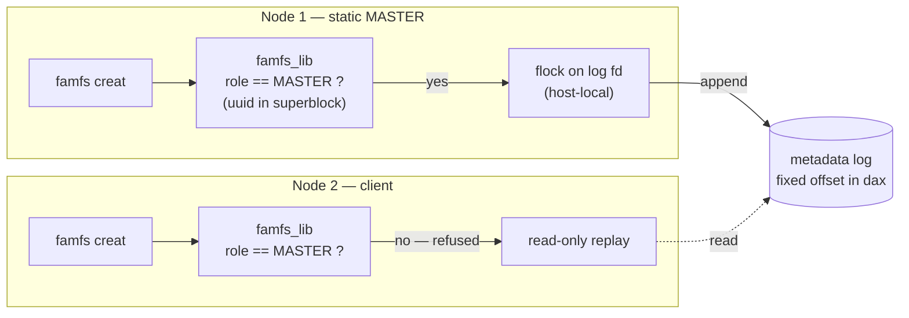

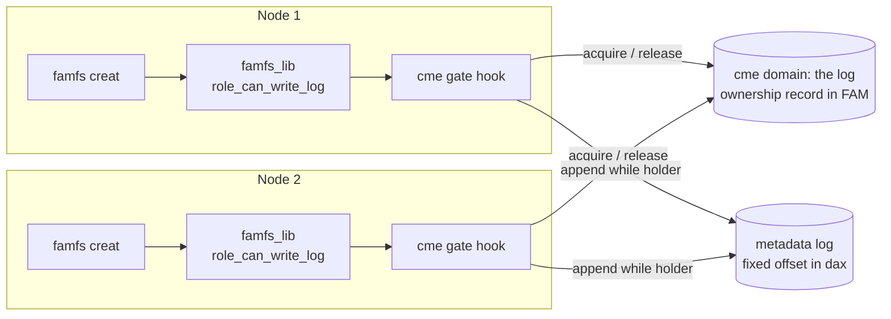

Everything else in famfs is untouched: the log format, the dax layout, the replay path, and the kernel.
Enabling is opt-in twice — a build option compiles the gate in, and `FAMFS_CME_URI` turns it on at run time.
With either absent, famfs takes the legacy path unchanged.

### B.3 Evaluation (pending)

A deployment is two hosts sharing one dax device, and nothing below userspace changes for it: each host mounts once, as it does today, and the gate does the rest.
That hardware was not available, so the gate was exercised on a single host with two mounts standing in for two nodes.
It runs end to end there — both mounts create files concurrently, the log ends up with entries from both interleaved, and both mounts see every file.
That shows the mechanism works.
It does not show that it is worth having: on one host, `flock` alone would serialize the same appends.

One thing has to move first.
The CME region itself sits in shared memory local to the host here, which is enough while both peers are on one machine.
Two hosts have no such shared memory between them, so the region belongs in the same fabric-attached memory as the log — a slice of the device the filesystem's allocator leaves alone.

The measurement that belongs here is then a contention campaign on two hosts sharing one device: sustained concurrent creates, how the master rotates under load, and a writer killed mid-append.
It is not yet run, and this section is where it will go.

